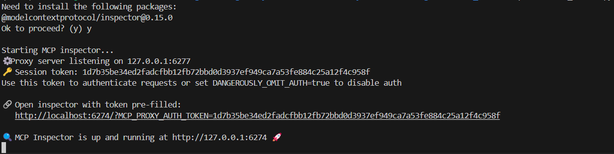
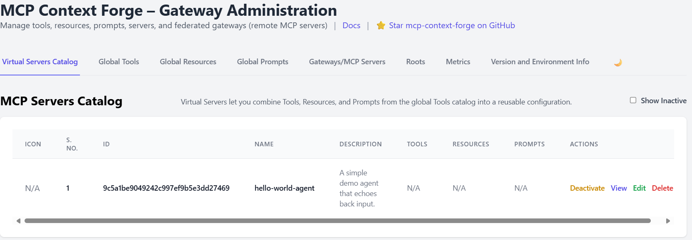
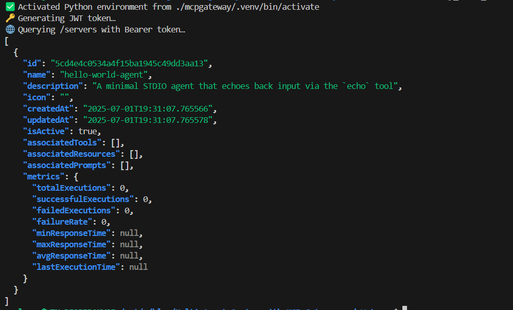

#  Watsonx.ai Agent to MCP Gateway


Welcome to this comprehensive guide on registering “agents” (back-end model/tool servers) in an MCP Gateway. We’ll start with a concise “Hello World” demo, then explore both the **Admin UI** and **HTTP API** methods, and finally walk through a complete example where we integrate a **Watsonx.ai Agent** into your gateway.

---

## 🚀 Table of Contents

1. [Prerequisites](#prerequisites)  
2. [Generating an Admin JWT](#generating-an-admin-jwt)  
3. [Hello World Agent (Demo)](#hello-world-agent-demo)  
   - A) [Via Admin UI](#via-admin-ui)  
   - B) [Via HTTP API](#via-http-api)  
4. [Building a Watsonx.ai Agent](#building-a-watsonxai-agent)  
   - Phase 1: Bootstrapping the Agent  
   - Phase 2: Registering in the Gateway  
5. [Verifying & Using Your Agent](#verifying--using-your-agent)  
6. [Appendix: Full Code Listings](#appendix-full-code-listings)  

---


## Prerequisites

### Step 1: Set up the MCP Gateway

1.  Clone the official MCP Gateway repository into the `mcpgateway` folder.
    ```bash
    git clone https://github.com/IBM/mcp-context-forge.git mcpgateway
    ```
    and enter to the directory
    ```bash
    cd mcpgateway
    ```

2.   Create a virtual environment in ./.venv
    
    ```bash
    python3 -m venv .venv
    ```
3.  Activate it and upgrade pip
    ```bash
        source .venv/bin/activate
        pip install --upgrade pip
    ```
4.  Install the dependencies.
    ```bash
    pip install -e .
    ```
5. Configure credentials  `.env` in your gateway directory containing at least:
    ```bash
    export BASIC_AUTH_USERNAME=admin
    export BASIC_AUTH_PASSWORD=changeme
    export JWT_SECRET_KEY=my-test-key
```


### 2) Start your MCP Gateway

We assume you have already cloned the repo into `mcpgateway/` and have:


```bash
cd mcpgateway
source .venv/bin/activate
./run.sh        # or: mcpgateway --host 0.0.0.0 --port 4444
```


Start the **MCP Gateway** up and running on `HOST:PORT`  (default `0.0.0.0:4444`). 

# Start MCP Gateway on all interfaces

```bash
mcpgateway --host 0.0.0.0 --port 4444 &
```
By default the CLI binds to 127.0.0.1:4444, user admin, pass admin. Let’s override that:


## Generating an Admin JWT

Many of the MCP Gateway’s administrative endpoints (for example, listing or registering servers via `/servers`) require two things:

1. A valid, short-lived JWT signed with your `JWT_SECRET_KEY`
2. HTTP Basic authentication using your admin user/password

You can generate and use one on your local machine in four simple steps:

1. **Activate your project venv**
   Make sure you’re running inside the same Python environment the gateway uses:

   ```bash
   source ./mcpgateway/.venv/bin/activate

   ```

2. **Export your admin credentials**
   Load your `.env` values, or provide sensible defaults:

   ```bash
   export BASIC_AUTH_USER="${BASIC_AUTH_USER:-admin}"
   export BASIC_AUTH_PASSWORD="${BASIC_AUTH_PASSWORD:-changeme}"
   export JWT_SECRET_KEY="${JWT_SECRET_KEY:-my-test-key}"
   ```

3. **Generate and store the token**
   This will print a JWT that’s valid for **60 seconds** and capture it into an environment variable:

   ```bash
   ADMIN_TOKEN=$(
     python3 -m mcpgateway.utils.create_jwt_token \
       --username "$BASIC_AUTH_USER" \
       --secret   "$JWT_SECRET_KEY" \
       --exp 60
   )
   echo " Generated Admin JWT"
   ```

4. **Call an admin endpoint**
   Pass **both** your Basic Auth credentials **and** the `Authorization: Bearer …` header, then display the token you used:

   ```bash
   curl -u "$BASIC_AUTH_USER:$BASIC_AUTH_PASSWORD" \
     -H "Authorization: Bearer $ADMIN_TOKEN" \
     http://localhost:4444/servers | jq .
   echo
   echo " Admin JWT was: $ADMIN_TOKEN"
   ```


### Full `get_token.sh` Script

```bash
#!/usr/bin/env bash
set -euo pipefail

# -----------------------------------------------------------------------------
# 1) Activate the project’s Python virtualenv
# -----------------------------------------------------------------------------
if [ -f "./mcpgateway/.venv/bin/activate" ]; then
  # shellcheck disable=SC1090
  source ./mcpgateway/.venv/bin/activate
  echo "✅ Activated Python environment"
else
  echo "❌ Virtualenv not found at ./mcpgateway/.venv/bin/activate; please run setup first." >&2
  exit 1
fi

# -----------------------------------------------------------------------------
# 2) Load env-vars (or use defaults)
# -----------------------------------------------------------------------------
export BASIC_AUTH_USER="${BASIC_AUTH_USER:-admin}"
export BASIC_AUTH_PASSWORD="${BASIC_AUTH_PASSWORD:-changeme}"
export JWT_SECRET_KEY="${JWT_SECRET_KEY:-my-test-key}"

# -----------------------------------------------------------------------------
# 3) Generate and print the JWT (valid for 60 seconds)
# -----------------------------------------------------------------------------
python3 -m mcpgateway.utils.create_jwt_token \
  --username "$BASIC_AUTH_USER" \
  --secret   "$JWT_SECRET_KEY" \
  --exp 60
```

Save this as `get_token.sh`, make it executable (`chmod +x get_token.sh`), and run:

```bash
./get_token.sh
```

It will output a single JWT string you can drop into your `Authorization: Bearer …` header.


### 1) Write your Hello World agent

Create this file at

```
agents/hello_world/hello_server.py
```

```python
# agents/hello_world/hello_server.py

import logging
from mcp.server.fastmcp import FastMCP

logging.basicConfig(level=logging.INFO, format="%(asctime)s [%(levelname)s] %(message)s")

# 1) Define a FastMCP server
mcp = FastMCP("Hello World Agent")

# 2) Expose an `echo` tool that simply returns whatever it gets
@mcp.tool()
def echo(text: str) -> str:
    logging.info("echo() called with %r", text)
    return text

# 3) Run on STDIO
if __name__ == "__main__":
    logging.info("Starting Hello World MCP server on STDIO…")
    mcp.run()
```

You can test it locally first:

```bash
cd agents/hello_world
```

2.   Create a virtual environment in ./.venv
    
    ```bash
    python3 -m venv .venv
    ```
3.  Activate it and upgrade pip
    ```bash
        source .venv/bin/activate
        pip install --upgrade pip
    ```

    ```bash
    pip install mcp[cli]       
    ```


```bash
mcp dev hello_server.py
# Inspector UI: http://localhost:6274
# Try calling `echo` with “Hello MCP!”
```


### 3) Register via the Admin UI

1. Open **[http://localhost:4444/admin](http://localhost:4444/admin)** and log in with your Basic Auth credentials.

2. Click **Catalog → Servers → Add Server**.

3. You’ll see only these fields:

   * **Name**
   * **Description**
   * **Icon URL** (optional)
   * **Associated Tools**
   * **Associated Resources** (comma-separated IDs)
   * **Associated Prompts** (comma-separated IDs)

4. Fill them like this:

   * **Name**:

     ```
     hello-world-agent
     ```
   * **Description**:

     ```
     A minimal STDIO agent that echoes back input via the `echo` tool
     ```
   * **Icon URL**:
     (leave blank, or point to a 32×32 PNG if you have one)
   * **Associated Tools**:
     Here you must supply the *tool names* your agent exposes—in our case:

     ```
     echo
     ```
   * **Associated Resources**:
     (leave empty)
   * **Associated Prompts**:
     (leave empty)

5. Click **Add Server**.

   The Gateway will now:

   1. **Spawn** your agent as a subprocess on STDIO by looking up `agents/hello_world/hello_server.py` in its configured “agents” directory.
   2. **Call** its MCP discovery (`mcp.inspect()`) to learn that it exposes the `echo` tool.
   3. **Activate** it—you’ll see `hello-world-agent` appear in your Servers list with a UUID.


---


---

### 4) Verify Your Agent

To script a one-stop check—activate your venv, mint a JWT, and list all registered servers—save this as `verify_servers.sh`, then `chmod +x verify_servers.sh`:

```bash
#!/usr/bin/env bash
set -euo pipefail

# 1) Activate the project venv
if [ -f "./mcpgateway/.venv/bin/activate" ]; then
  # shellcheck disable=SC1090
  source ./mcpgateway/.venv/bin/activate
else
  echo "❌ Virtualenv not found; please run setup first." >&2
  exit 1
fi

# 2) Export credentials (or use defaults)
export BASIC_AUTH_USER="${BASIC_AUTH_USER:-admin}"
export BASIC_AUTH_PASSWORD="${BASIC_AUTH_PASSWORD:-changeme}"
export JWT_SECRET_KEY="${JWT_SECRET_KEY:-my-test-key}"

# 3) Mint a short-lived JWT
ADMIN_TOKEN=$(
  JWT_SECRET_KEY="$JWT_SECRET_KEY" \
    python3 -m mcpgateway.utils.create_jwt_token \
      --username "$BASIC_AUTH_USER" \
      --secret   "$JWT_SECRET_KEY" \
      --exp 60
)
echo "✅ Generated ADMIN_TOKEN"

# 4) List all servers
curl -s \
  -H "Authorization: Bearer $ADMIN_TOKEN" \
  http://localhost:4444/servers \
| jq .
```

Running `./verify_servers.sh` will print the JSON array of all your registered agents—confirming that **hello-world-agent** is active.

---

### 5) Try it out

Now that your agent is both registered and active, any MCP-aware client can invoke its `echo` tool. For example, with the `mcp` CLI:

```bash
mcp call \
  --server http://localhost:4444 \
  servers/<your-agent-uuid> \
  echo "Hello, MCP!"
# → "Hello, MCP!"
```

Or directly via raw HTTP:

```bash
curl -X POST http://localhost:4444/ \
  -H "Content-Type: application/json" \
  -d '{
        "jsonrpc":"2.0",
        "method":"tools/call",
        "params":{
          "serverId":"<your-agent-uuid>",
          "name":"echo",
          "arguments":{"text":"Hello, MCP!"}
        },
        "id":1
      }'
# → {"jsonrpc":"2.0","result":"Hello, MCP!","id":1}
```


### 4) Verify Your Agent

Once your **hello-world-agent** is registered, you can verify it by generating an admin JWT and listing all servers via the Gateway’s HTTP API. Save the following as `verify_servers.sh`, make it executable (`chmod +x verify_servers.sh`), and run it from your project root:

```bash
#!/usr/bin/env bash
set -euo pipefail

# -----------------------------------------------------------------------------
# 1) Activate the project’s Python virtualenv
# -----------------------------------------------------------------------------
if [ -f "./mcpgateway/.venv/bin/activate" ]; then
  # shellcheck disable=SC1090
  source ./mcpgateway/.venv/bin/activate
  echo "✅ Activated Python environment from ./mcpgateway/.venv/bin/activate"
else
  echo "❌ Virtualenv not found at ./mcpgateway/.venv/bin/activate; please run your setup/start scripts first."
  exit 1
fi

# -----------------------------------------------------------------------------
# 2) Ensure env-vars are set (fall back to defaults if not)
# -----------------------------------------------------------------------------
export BASIC_AUTH_USER="${BASIC_AUTH_USER:-admin}"
export BASIC_AUTH_PASSWORD="${BASIC_AUTH_PASSWORD:-changeme}"
export JWT_SECRET_KEY="${JWT_SECRET_KEY:-my-test-key}"

# -----------------------------------------------------------------------------
# 3) Generate a short-lived JWT using the gateway’s utility
# -----------------------------------------------------------------------------
echo "🔑 Generating JWT token…"
ADMIN_TOKEN=$(
  JWT_SECRET_KEY="$JWT_SECRET_KEY" \
    python3 -m mcpgateway.utils.create_jwt_token \
      --username "$BASIC_AUTH_USER" \
      --exp 60 \
      --secret "$JWT_SECRET_KEY"
)
export ADMIN_TOKEN

# -----------------------------------------------------------------------------
# 4) Call the /servers endpoint with Bearer auth
# -----------------------------------------------------------------------------
echo "🌐 Querying /servers with Bearer token…"
curl -s \
  -H "Authorization: Bearer $ADMIN_TOKEN" \
  http://localhost:4444/servers \
| jq .
```



**What this does:**

1. **Activate the virtualenv**
   Ensures you’re using the same Python environment (and MCP Gateway libraries) that are installed under `mcpgateway/.venv/`.

2. **Load credentials**
   Exports `BASIC_AUTH_USER`, `BASIC_AUTH_PASSWORD`, and your `JWT_SECRET_KEY`—falling back to `admin`, `changeme`, and `my-test-key` if not already set in your shell.

3. **Generate a JWT**
   Uses the built-in `mcpgateway.utils.create_jwt_token` module to mint a token valid for 60 seconds, signing it with your `JWT_SECRET_KEY`. This token is required for all admin-level HTTP calls.

4. **List registered servers**
   Sends a `GET /servers` request with `Authorization: Bearer …`. The JSON output will include your new **hello-world-agent** (alongside its UUID, name, and exposed tools), confirming that the Gateway sees and manages your agent correctly.


### 6) Next up: Watsonx.ai Agent 

With the Hello World demo behind you, you’re ready to plug in our full **Watsonx.ai** agent exactly the same way—just substitute:

* **Tool name**: `chat`
* **Server code**: your `agents/watsonx-agent/server.py` 
* **Associated Tools**: `chat`

Everything else (JWT, UI, CLI) stays identical. Enjoy building your multi-agent workflows!


## Building a Watsonx.ai Agent

Now let’s build and register a real-world agent that wraps IBM Watsonx.ai.

### Phase 1: Bootstrapping the Agent

1. **Provision Watsonx.ai**

   * In IBM Cloud, create or reuse a Watsonx.ai inference service.
   * Generate an API key and note your service URL (e.g. `https://api.us-south.watsonx.ai`).
   * Retrieve your **Project ID**.

2. **Initialize Project**

   ```bash
   mkdir watsonx-agent && cd watsonx-agent
   python3.11 -m venv .venv
   source .venv/bin/activate
   ```

3. **Define Dependencies** in `requirements.txt`:

   ```text
   python-dotenv>=0.21.0
   ibm-watsonx-ai>=1.3.8
   mcp[cli]>=1.6.0
   ```

   Install them:

   ```bash
   pip install --upgrade pip
   pip install -r requirements.txt
   ```

4. **Secure Credentials**
   Create `.env` (add to `.gitignore`):

   ```dotenv
   WATSONX_API_KEY=YOUR_API_KEY
   WATSONX_URL=https://api.us-south.watsonx.ai
   PROJECT_ID=YOUR_PROJECT_ID
   MODEL_ID=ibm/granite-3-3-8b-instruct
   ```

5. **Write `server.py`** (stdio transport):

   ```python
   # server.py
   import os, logging
   from dotenv import load_dotenv
   from mcp.server.fastmcp import FastMCP
   from ibm_watsonx_ai import APIClient, Credentials
   from ibm_watsonx_ai.foundation_models import ModelInference
   from ibm_watsonx_ai.metanames import GenTextParamsMetaNames as GenParams

   # Load settings
   load_dotenv()
   API_KEY    = os.getenv("WATSONX_API_KEY")
   URL        = os.getenv("WATSONX_URL")
   PROJECT_ID = os.getenv("PROJECT_ID")
   MODEL_ID   = os.getenv("MODEL_ID", "ibm/granite-3-3-8b-instruct")

   for name, val in [("WATSONX_API_KEY", API_KEY), ("WATSONX_URL", URL), ("PROJECT_ID", PROJECT_ID)]:
       if not val:
           raise RuntimeError(f"{name} is not set")

   logging.basicConfig(level=logging.INFO, format="%(asctime)s [%(levelname)s] %(message)s")

   creds  = Credentials(url=URL, api_key=API_KEY)
   client = APIClient(credentials=creds, project_id=PROJECT_ID)
   model  = ModelInference(model_id=MODEL_ID, credentials=creds, project_id=PROJECT_ID)

   mcp = FastMCP("Watsonx Chat Agent")

   @mcp.tool()
   def chat(query: str) -> str:
       logging.info("chat() got %r", query)
       params = {
         GenParams.DECODING_METHOD: "greedy",
         GenParams.MAX_NEW_TOKENS:   200,
       }
       resp = model.generate_text(prompt=query, params=params, raw_response=True)
       text = resp["results"][0]["generated_text"].strip()
       logging.info("→ %r", text)
       return text

   if __name__ == "__main__":
       logging.info("Starting Watsonx MCP server on STDIO…")
       mcp.run()
   ```

6. **Test Locally** 
  ```
  python server.py
  ```

  or with the MCP Inspector:

   ```bash
   mcp dev server.py
   # Inspector UI: http://localhost:6274
   ```
 Or tell mcp dev to use different ports
 ```bash
  mcp dev server.py --inspect-port 6280 --proxy-port 6281
   ```

## Phase 2: Registering the Watsonx.ai Agent in the Gateway

### Via Admin UI

1. **Open the Admin UI**
   Visit [`/admin`](http://localhost:4444/admin) and log in with your Basic-Auth creds (`admin`/`changeme`).

2. **Click** **Catalog → Servers → Add Server**.

3. **You’ll see only these fields:**

   * **Name**
   * **Description**
   * **Icon URL** (optional)
   * **Associated Tools**
   * **Associated Resources** (comma-separated IDs)
   * **Associated Prompts** (comma-separated IDs)

4. **Fill them like this:**

   * **Name**:

     ```
     watsonx-agent
     ```
   * **Description**:

     ```
     A Watsonx.ai-backed STDIO agent exposing a `chat` tool
     ```
   * **Icon URL**:
     *(leave blank)*
   * **Associated Tools**:

     ```
     chat
     ```
   * **Associated Resources**:
     *(leave empty)*
   * **Associated Prompts**:
     *(leave empty)*

5. **Click** **Add Server**.
   The Gateway will:

   1. Spawn `agents/watsonx-agent/server.py` over STDIO
   2. Call its MCP discovery to learn about the `chat` tool
   3. Mark **watsonx-agent** as active in the Servers list


---

### Verifying the Agent

Save and run `verify_watsonx.sh` to ensure your server is active and serving the `chat` tool:

```bash
#!/usr/bin/env bash
set -euo pipefail

# 1) Activate venv
source ./mcpgateway/.venv/bin/activate

# 2) Ensure creds
export BASIC_AUTH_USER="${BASIC_AUTH_USER:-admin}"
export JWT_SECRET_KEY="${JWT_SECRET_KEY:-my-test-key}"

# 3) Mint JWT
ADMIN_TOKEN=$(
  JWT_SECRET_KEY="$JWT_SECRET_KEY" \
    python3 -m mcpgateway.utils.create_jwt_token \
      --username "$BASIC_AUTH_USER" \
      --secret   "$JWT_SECRET_KEY" \
      --exp      60
)

# 4) List servers & their tools
curl -s \
  -H "Authorization: Bearer $ADMIN_TOKEN" \
  http://localhost:4444/servers \
| jq .

```

Look for an entry like:

```json
[
  {
    "name": "watsonx-agent",
    "isActive": true,
    "associatedTools": ["chat"],
    …
  }
]
```


## MCP Servers Catalog

Virtual Servers let you combine Tools, Resources, and Prompts from the global Tools catalog into a reusable configuration.

> **Show Inactive**

| Icon | S. No. | ID                                 | Name          | Description                                            | Tools | Resources | Prompts | Actions                           |
| ---- | ------ | ---------------------------------- | ------------- | ------------------------------------------------------ | :---: | :-------: | :-----: | --------------------------------- |
| N/A  | 1      | `ed4d915a5ad2461795010e5e28af4848` | watsonx-agent | A Watsonx.ai-backed STDIO agent exposing a `chat` tool |  N/A  |    N/A    |   N/A   | Deactivate · View · Edit · Delete |

[Add New Server](#/admin/servers/add)

---

Of course. Here is the corrected and streamlined version of your blog section, incorporating the script's logic for a smoother user experience.

The main changes are:

  * **Automated Server ID:** The script in Step 2 now automatically finds the active `watsonx-agent` and exports its `SERVER_ID`. The manual copy-paste step has been removed.
  * **Clarity and Flow:** The instructions are simplified to guide the user to run the commands in the same terminal session, ensuring the environment variables (`$ADMIN_TOKEN`, `$SERVER_ID`) are carried over correctly.
  * **Improved One-Liner:** The optional one-liner is now fully automated and can be run with a single copy-paste.


## Calling Your Watsonx Agent

Once your `watsonx-agent` is running and shows up as **active** in the MCP Gateway’s `/servers` list, you can invoke its `chat` tool via a simple HTTP POST.


### 1\. Start the Gateway & Agent

First, in one terminal shell, start your agent from your project root.

```bash
# Activate the agent's virtual environment
source ./agents/watsonx-agent/.venv/bin/activate

# Navigate to the agent's directory
cd agents/watsonx-agent

# Start the agent via the mcp CLI
mcp dev server.py
```

Leave this terminal running. You should see a log confirming the agent has started and registered with the gateway.

-----

### 2\. Find and Export Your Agent's Server ID

Next, in a **new terminal shell**, run the following script. It will authenticate with the gateway, find the server ID for your active `watsonx-agent`, and export it as an environment variable (`$SERVER_ID`).

```bash
#!/usr/bin/env bash
set -euo pipefail

# --- Credentials ---
export BASIC_AUTH_USER="${BASIC_AUTH_USER:-admin}"
export JWT_SECRET_KEY="${JWT_SECRET_KEY:-my-test-key}"

# --- Mint an Admin JWT ---
ADMIN_TOKEN=$(
    python3 -m mcpgateway.utils.create_jwt_token \
      --username "$BASIC_AUTH_USER" \
      --secret   "$JWT_SECRET_KEY" \
      --exp      60
)

# --- Find and Export the Server ID ---
echo "🔎 Searching for active 'watsonx-agent'..."
export SERVER_ID=$(
    curl -s -H "Authorization: Bearer $ADMIN_TOKEN" http://localhost:4444/servers | \
    jq -r '.[] | select(.name == "watsonx-agent" and .isActive == true) | .id'
)

# --- Validate and Confirm ---
if [ -z "$SERVER_ID" ]; then
    echo "❌ Could not find an active server named 'watsonx-agent'."
    echo "Please ensure the agent is running and registered with the gateway."
    exit 1
else
    echo "✅ Agent found! Exporting SERVER_ID=${SERVER_ID}"
fi
```

After running the script, the `$SERVER_ID` is set and ready to use in this terminal.

-----

### 3\. Invoke the `chat` Tool

Now, in that **same terminal**, you can use the `$SERVER_ID` to call the agent's `chat` tool.

This command uses the `$SERVER_ID` and `$ADMIN_TOKEN` variables you just exported.

```bash
curl -u "$BASIC_AUTH_USER:$BASIC_AUTH_PASSWORD" \
     -H "Authorization: Bearer $ADMIN_TOKEN" \
     -X POST "http://localhost:4444/servers/$SERVER_ID/chat" \
     -H "Content-Type: application/json" \
     -d '{"query":"Tell me a joke."}' \
| jq .
```

You should get back a JSON response with the agent's reply:

```json
{
  "result": "Why did the scarecrow win an award? Because he was outstanding in his field!"
}
```

-----

### 4\. One-Liner (Optional)

If you prefer, you can combine all the steps into a single, powerful command. This one-liner sets your credentials, finds the server ID, mints a fresh token, and calls the agent. Just copy and paste it into your terminal.

```bash
( \
export BASIC_AUTH_USER="${BASIC_AUTH_USER:-admin}"; \
export JWT_SECRET_KEY="${JWT_SECRET_KEY:-my-test-key}"; \
export SERVER_ID=$(curl -s -H "Authorization: Bearer $(python3 -m mcpgateway.utils.create_jwt_token --username "$BASIC_AUTH_USER" --secret "$JWT_SECRET_KEY" --exp 60)" http://localhost:4444/servers | jq -r '.[] | select(.name == "watsonx-agent" and .isActive == true) | .id'); \
ADMIN_TOKEN=$(python3 -m mcpgateway.utils.create_jwt_token --username "$BASIC_AUTH_USER" --secret "$JWT_SECRET_KEY" --exp 60); \
if [ -z "$SERVER_ID" ]; then echo '❌ Agent not found!'; else \
curl -u "$BASIC_AUTH_USER:$BASIC_AUTH_PASSWORD" -H "Authorization: Bearer $ADMIN_TOKEN" -X POST "http://localhost:4444/servers/$SERVER_ID/chat" -H "Content-Type: application/json" -d '{"query":"Tell me a joke."}' | jq .; \
fi \
)
```


### 2 · Raw HTTP JSON-RPC

Save this as **`curl_watsonx.sh`** (token lasts 60 s, so re-mint if needed):

```bash
#!/usr/bin/env bash
# curl_watsonx.sh — invoke Watsonx chat with plain curl
# Usage: ./curl_watsonx.sh <ADMIN_TOKEN> "<Your question>"

set -euo pipefail

ADMIN_TOKEN="$1"
PROMPT="${2:-Explain serverless in one paragraph}"

curl -sS -X POST http://localhost:4444/ \
  -H "Content-Type: application/json" \
  -H "Authorization: Bearer $ADMIN_TOKEN" \
  -d '{
        "jsonrpc":"2.0",
        "method":"tools/call",
        "params":{
          "name":"chat",
          "arguments":{"query":"'"${PROMPT//\"/\\\"}"'"}
        },
        "id":1
      }' \
| jq .
```

Make it executable and run:

```bash
chmod +x curl_watsonx.sh
./curl_watsonx.sh "$ADMIN_TOKEN" "Tell me a limerick about AI"
```

Typical JSON response:

```json
{
  "jsonrpc": "2.0",
  "result": "There once was an AI so bright…",
  "id": 1
}
```


🎉 **Congratulations!** You’ve successfully added your Watsonx.ai Agent to MCP Gateway. Now go build awesome multi-agent applications!
