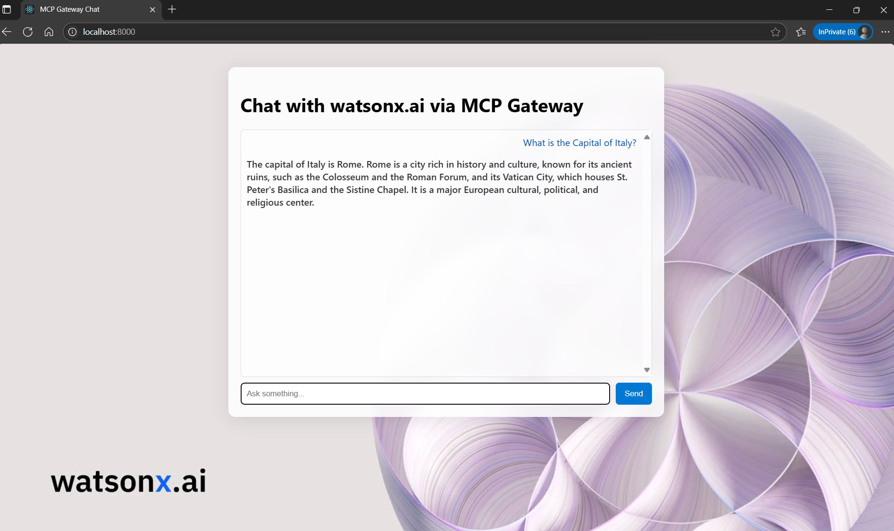
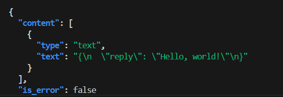
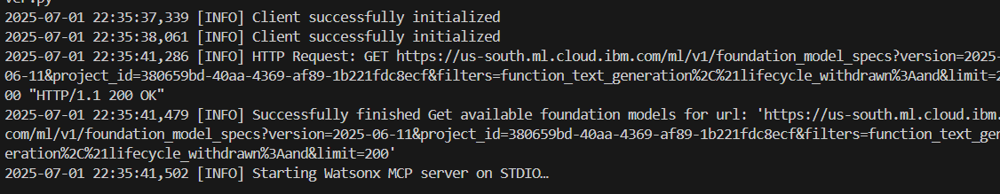
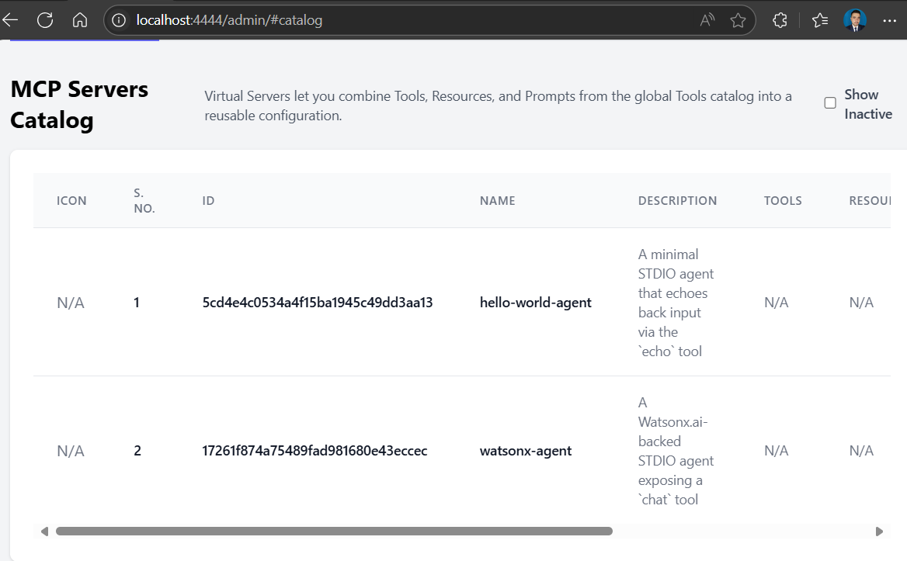
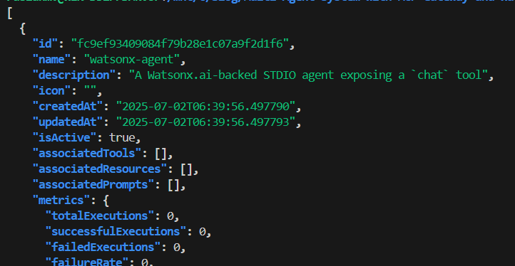

#  Watsonx.ai Agent to MCP Gateway


Welcome to this comprehensive guide on registering “agents” (back-end model/tool servers) in an MCP Gateway. We’ll start with a concise “Hello World” demo, then explore both the **Admin UI** and **HTTP API** methods, and finally walk through a complete example where we integrate a **Watsonx.ai Agent** into your gateway.



---

## 🚀 Table of Contents
1.  Introduction
2.  Prerequisites: Setting Up the MCP Gateway
3.  Generating an Admin JWT
4.  Hello World: Your First Federated Agent
5.  Building a Real-World Agent with IBM Watsonx.ai
    - Phase 1: Bootstrapping the Agent
    - Phase 2: Starting and Registering the Agent
    - Phase 3: End-to-End Interactive Testing
    - Phase 4 (Bonus): Adding a Web Frontend
6.  Conclusion

## Introduction

In today's AI-driven world, connecting different language models, APIs, and custom tools can get complicated fast. Imagine trying to make a dozen different devices with unique plugs all work together—it's a tangled mess! The **Model Context Protocol (MCP)** and the **MCP Gateway** solve this problem by creating a universal standard for all your AI services.

### What is MCP?
Think of **MCP** as a universal language that lets any AI tool or service talk to any other, no matter how it's built or where it's running. It standardizes how tools are called and how they respond, making them interchangeable.

### What is the MCP Gateway?
The **MCP Gateway**, also known as Context Forge, is the central hub or "air traffic controller" for all your MCP-speaking services. Instead of connecting everything point-to-point, you simply register each service with the Gateway. The Gateway then handles:

* **Discovery**: It finds all the tools your services offer and creates a unified catalog.
* **Routing**: It directs requests to the right tool on the right server.
* **Security & Management**: It provides a single point for authentication, monitoring, and health checks.
* **Ease of Use**: A web dashboard lets you see and manage everything in one place.

By using MCP and the Gateway, you replace brittle, custom integrations with a robust and scalable system, allowing you to build powerful AI workflows with ease.

## Prerequisites

### Step 1: Set up the MCP Gateway

1.  Clone the official MCP Gateway repository into the `mcpgateway` folder.
    ```bash
    git clone https://github.com/IBM/mcp-context-forge.git mcpgateway
    ```
    and enter to the directory
    ```bash
    cd mcpgateway
    ```

2.   Create a virtual environment in ./.venv
    
    ```bash
    python3 -m venv .venv
    ```
3.  Activate it and upgrade pip
    ```bash
        source .venv/bin/activate
        pip install --upgrade pip
    ```
4.  Install the dependencies.
    ```bash
    pip install -e .
    ```
5. Configure credentials  `.env` in your gateway directory containing at least:
    ```bash
    export BASIC_AUTH_USERNAME=admin
    export BASIC_AUTH_PASSWORD=changeme
    export JWT_SECRET_KEY=my-test-key
```


### 2) Start your MCP Gateway

We assume you have already cloned the repo into `mcpgateway/` and have:


```bash
cd mcpgateway
source .venv/bin/activate
./run.sh        # or: mcpgateway --host 0.0.0.0 --port 4444
```


Start the **MCP Gateway** up and running on `HOST:PORT`  (default `0.0.0.0:4444`). 

# Start MCP Gateway on all interfaces

```bash
mcpgateway --host 0.0.0.0 --port 4444 &
```
By default the CLI binds to 127.0.0.1:4444, user admin, pass admin. Let’s override that:


## Generating an Admin JWT

Many of the MCP Gateway’s administrative endpoints (for example, listing or registering servers via `/servers`) require two things:

1. A valid, short-lived JWT signed with your `JWT_SECRET_KEY`
2. HTTP Basic authentication using your admin user/password

You can generate and use one on your local machine in four simple steps:

1. **Activate your project venv**
   Make sure you’re running inside the same Python environment the gateway uses:

   ```bash
   source ./mcpgateway/.venv/bin/activate

   ```

2. **Export your admin credentials**
   Load your `.env` values, or provide sensible defaults:

   ```bash
   export BASIC_AUTH_USER="${BASIC_AUTH_USER:-admin}"
   export BASIC_AUTH_PASSWORD="${BASIC_AUTH_PASSWORD:-changeme}"
   export JWT_SECRET_KEY="${JWT_SECRET_KEY:-my-test-key}"
   ```

3. **Generate and store the token**
   This will print a JWT that’s valid for **60 seconds** and capture it into an environment variable:

   ```bash
   ADMIN_TOKEN=$(
     python3 -m mcpgateway.utils.create_jwt_token \
       --username "$BASIC_AUTH_USER" \
       --secret   "$JWT_SECRET_KEY" \
       --exp 60
   )
   echo " Generated Admin JWT"
   ```

4. **Call an admin endpoint**
   Pass **both** your Basic Auth credentials **and** the `Authorization: Bearer …` header, then display the token you used:

   ```bash
   curl -u "$BASIC_AUTH_USER:$BASIC_AUTH_PASSWORD" \
     -H "Authorization: Bearer $ADMIN_TOKEN" \
     http://localhost:4444/servers | jq .
   echo
   echo " Admin JWT was: $ADMIN_TOKEN"
   ```

### Full `get_token.sh` Script

```bash
#!/usr/bin/env bash
set -euo pipefail

# -----------------------------------------------------------------------------
# 1) Activate the project’s Python virtualenv
# -----------------------------------------------------------------------------
if [ -f "./mcpgateway/.venv/bin/activate" ]; then
  # shellcheck disable=SC1090
  source ./mcpgateway/.venv/bin/activate
  echo "✅ Activated Python environment"
else
  echo "❌ Virtualenv not found at ./mcpgateway/.venv/bin/activate; please run setup first." >&2
  exit 1
fi

# -----------------------------------------------------------------------------
# 2) Load env-vars (or use defaults)
# -----------------------------------------------------------------------------
export BASIC_AUTH_USER="${BASIC_AUTH_USER:-admin}"
export BASIC_AUTH_PASSWORD="${BASIC_AUTH_PASSWORD:-changeme}"
export JWT_SECRET_KEY="${JWT_SECRET_KEY:-my-test-key}"

# -----------------------------------------------------------------------------
# 3) Generate and print the JWT (valid for 60 seconds)
# -----------------------------------------------------------------------------
python3 -m mcpgateway.utils.create_jwt_token \
  --username "$BASIC_AUTH_USER" \
  --secret   "$JWT_SECRET_KEY" \
  --exp 60
```

Save this as `get_token.sh`, make it executable (`chmod +x get_token.sh`), and run:

```bash
./get_token.sh
```

## Hello World Agent
The MCP Gateway discovers and federates external agents over **HTTP-based transports**.
That means every remote server must expose a *socket-friendly* endpoint (Server-Sent Events or Streamable-HTTP) so the Gateway can open a connection, perform the MCP handshake—

```
initialize ──▶ list_tools ──▶ …
```

—receive its catalog, and keep the stream alive.

A script that runs in the **default STDIO mode** (`mcp.run()` with no arguments) never opens an HTTP port. When the Gateway tries to talk to such an agent—say at `http://127.0.0.1:6277`—all it sees is a silent TCP socket. `httpx` gives up, AnyIO bubbles an *“unhandled errors in a TaskGroup”*, and the Gateway marks the registration as failed.

Below you’ll rewrite the canonical *echo* agent to speak **SSE**, register it, and test it from the Admin UI.

---

### 1 Write the agent (SSE edition)

Create `agents/hello_world/hello_server_sse.py`:

```python
import logging
from typing import Union
from mcp.server.fastmcp import FastMCP

# readable logs
logging.basicConfig(level=logging.INFO,
                    format="%(asctime)s [%(levelname)s] %(message)s")

PORT = 6274                                   # the port you'll register
mcp  = FastMCP(name="hello-world-agent", port=PORT)

@mcp.tool(description="Echo back whatever you send (str or int)")
async def echo(text: Union[str, int]) -> dict:
    """
    Accept both strings and integers so the Gateway's test dialog
    (which auto-fills 0) passes validation.
    """
    logging.info("echo(%r)", text)
    return {"reply": str(text)}

if __name__ == "__main__":
    logging.info("🚀 Serving on http://127.0.0.1:%d/sse", PORT)
    mcp.run(transport="sse")                  # ⭐  key line: use SSE
```

---

### 2 Run it locally

```bash
source ./mcpgateway/.venv/bin/activate   # activate the same venv the Gateway uses
cd agents/hello_world
python hello_server_sse.py
```

Console output:

```
🚀 Serving on http://127.0.0.1:6274/sse
INFO:     Started server process [94661]
INFO:     Application startup complete.
INFO:     Uvicorn running on http://127.0.0.1:6274 (Press CTRL+C to quit)
```

The agent is now streaming MCP events over `/sse`.

---

### 3 Register it in the Gateway

Open **Admin UI → Federated Gateways → Add New Gateway** and fill:

* **Name** `hello-world-dev`
* **URL**  `http://127.0.0.1:6274/sse`
* **Transport Type** `SSE`
* **Auth** `None`

Click **Add Gateway**. You should instantly see:

```
hello-world-dev   http://127.0.0.1:6274/sse   Active   <timestamp>
```

Opening the entry shows *Capabilities* and a single *Echo* tool.

---

### 4 Test the tool from the UI

1. Navigate to **Tools** → find `hello-world-dev-echo`.
2. Click **Test**.
3. Replace the default `0` with any text, e.g. `Hello Gateway`.
4. Press **Run Tool**.

The response pane shows:

```json
{
  "reply": "Hello Gateway"
}
```

---


* **STDIO** agents are great for piping output in a terminal,
  but the Gateway speaks **HTTP streams**.
* Switching `mcp.run()` to `transport="sse"` (or `"streamable-http"`) gives
  the Gateway a live URL to open, negotiate, and keep healthy.
* Once registered, the agent’s tools behave just like native ones—ready to
  combine into virtual servers or call via the Gateway’s `/rpc` endpoint.


### 5 Publish in the Virtual Servers Catalog

Once your Hello World agent is federated as an MCP Server (under **Federated Gateways**) and its `echo` tool appears in the **Global Tools** catalog, the final step is to bundle it into a **Virtual Server**—a single endpoint that exposes one or more tools (and any resources or prompts) under your own chosen name.

1. **Open** the Admin UI and navigate to **Virtual Servers Catalog → Add New Server**.
2. **Fill in** the form fields:

   * **Name**: `hello-world-dev`
   * **Description**: (optional, e.g. “Demo echo server”)
   * **Icon URL**: (leave blank or supply a link to a 64×64 PNG)
   * **Associated Tools**: select both

     ```
     watsonx-agent-chat
     hello-world-dev-echo
     ```
   * **Associated Resources**: type the resource IDs you registered earlier, comma-separated, e.g.

     ```
     hello-world-dev
     ```
   * **Associated Prompts**: leave empty for this demo
3. **Click** **Add Server**.

Your **Virtual Servers Catalog** now lists:

```text
hello-world-dev   Demo echo server   Active   <timestamp>
```

Under **Tools** you’ll see the combined toolset:

```text
hello-world-dev-echo   Echo back whatever you send (str or int)
watsonx-agent-chat     Chat with IBM watsonx.ai (dummy)
```

---

### 6 Calling your Virtual Server from the CLI

With the virtual server in place, you can invoke its tools from any script or terminal—no UI required. Below is a standalone Bash script, `call_echo.sh`, that demonstrates:

* **Minting** a short-lived admin JWT
* **Building** a JSON-RPC request to the `/rpc` endpoint
* **Calling** the `hello-world-dev-echo` tool with a prompt
* **Pretty-printing** the response

```bash
#!/usr/bin/env bash
# call_echo.sh – invoke any federated MCP tool via Gateway /rpc
set -euo pipefail

# ─── Configuration ──────────────────────────────────────────────────────────
GATEWAY_URL="${GATEWAY_URL:-http://localhost:4444}"
RPC_URL="${GATEWAY_URL}/rpc"

# First argument: full tool name as shown in Admin UI
TOOL_NAME="${1:-hello-world-dev-echo}"
# Second argument: the text to echo
PROMPT="${2:-Hello, world!}"

# Basic Auth credentials for /rpc (if still enabled)
BASIC_AUTH_USER="${BASIC_AUTH_USER:-admin}"
BASIC_AUTH_PASS="${BASIC_AUTH_PASS:-changeme}"

# JWT secret (must match Gateway’s JWT_SECRET_KEY)
JWT_SECRET_KEY="${JWT_SECRET_KEY:-my-test-key}"

# ─── Mint an admin token (valid 60s) ────────────────────────────────────────
ADMIN_TOKEN=$(python3 -m mcpgateway.utils.create_jwt_token \
  --username "$BASIC_AUTH_USER" \
  --secret   "$JWT_SECRET_KEY" \
  --exp      60)

# ─── Build JSON-RPC payload via jq (proper quoting) ─────────────────────────
JSON_PAYLOAD=$(jq -n \
  --arg method "$TOOL_NAME" \
  --arg txt    "$PROMPT" \
  '{jsonrpc:"2.0",id:1,method:$method,params:{text:$txt}}')

# ─── Invoke and display the response ────────────────────────────────────────
echo
echo "🚀 Calling tool: $TOOL_NAME"
echo "   Prompt: \"$PROMPT\""
echo

curl -s -u "${BASIC_AUTH_USER}:${BASIC_AUTH_PASS}" \
     -H "Authorization: Bearer ${ADMIN_TOKEN}" \
     -H "Content-Type: application/json" \
     -d "$JSON_PAYLOAD" \
     "$RPC_URL" \
  | jq .

echo
```


### 7 Example run

```bash
chmod +x call_echo.sh
./call_echo.sh 

🚀 Calling tool: hello-world-dev-echo
   Prompt: "Hello, world!"

{
  "content": [
    {
      "type": "text",
      "text": "{\n  \"reply\": \"Hello, world!\"\n}"
    }
  ],
  "is_error": false
}
```



The `"content"` array holds the structured tool output. In this demo the
tool returned `{"reply":"Hello, world!"}` and the Gateway wrapped it in an
MCP-compliant notification envelope.

---

With that, you have:

1. **Built** an SSE-based Hello World agent
2. **Federated** it into the MCP Gateway
3. **Bundled** it into a Virtual Server
4. **Invoked** its tool via a simple CLI script


### 6) Next up: Watsonx.ai Agent 

With the Hello World demo behind you, you’re ready to plug in our full **Watsonx.ai** agent exactly the same way—just substitute:

* **Tool name**: `chat`
* **Server code**: your `agents/watsonx-agent/server.py` 
* **Associated Tools**: `chat`

Everything else (JWT, UI, CLI) stays identical. Enjoy building your multi-agent workflows!


## Building a Watsonx.ai Agent

Now let’s build and register a real-world agent that wraps IBM Watsonx.ai.

### Phase 1: Bootstrapping the Agent

1. **Provision Watsonx.ai**

   * In IBM Cloud, create or reuse a Watsonx.ai inference service.
   * Generate an API key and note your service URL (e.g. `https://api.us-south.watsonx.ai`).
   * Retrieve your **Project ID**.

2. **Initialize Project**

   ```bash
   mkdir watsonx-agent && cd watsonx-agent
   python3.11 -m venv .venv
   source .venv/bin/activate
   ```

3. **Define Dependencies** in `requirements.txt`:

   ```text
   python-dotenv>=0.21.0
   ibm-watsonx-ai>=1.3.8
   mcp[cli]>=1.6.0
   ```

   Install them:

   ```bash
   pip install --upgrade pip
   pip install -r requirements.txt
   ```

4. **Secure Credentials**
   Create `.env` (add to `.gitignore`):

   ```dotenv
   WATSONX_API_KEY=YOUR_API_KEY
   WATSONX_URL=https://api.us-south.watsonx.ai
   PROJECT_ID=YOUR_PROJECT_ID
   MODEL_ID=ibm/granite-3-3-8b-instruct
   ```

5. **Write `server_sse.py`** (stdio transport):

   ```python
# server.py  – lenient Watsonx agent
import os, logging
from typing import Union
from dotenv import load_dotenv

from mcp.server.fastmcp import FastMCP
from ibm_watsonx_ai import APIClient, Credentials
from ibm_watsonx_ai.foundation_models import ModelInference
from ibm_watsonx_ai.metanames import GenTextParamsMetaNames as GenParams

# ─── Load env vars ───────────────────────────────────────────────
load_dotenv()
API_KEY    = os.getenv("WATSONX_API_KEY")
URL        = os.getenv("WATSONX_URL")
PROJECT_ID = os.getenv("PROJECT_ID")
MODEL_ID   = os.getenv("MODEL_ID", "ibm/granite-3-3-8b-instruct")
PORT       = int(os.getenv("PORT", 6288))

for name, val in [("WATSONX_API_KEY", API_KEY),
                  ("WATSONX_URL",     URL),
                  ("PROJECT_ID",      PROJECT_ID)]:
    if not val:
        raise RuntimeError(f"{name} is not set")

logging.basicConfig(
    level=logging.INFO,
    format="%(asctime)s [%(levelname)s] %(message)s"
)

creds  = Credentials(url=URL, api_key=API_KEY)
client = APIClient(credentials=creds, project_id=PROJECT_ID)
model  = ModelInference(model_id=MODEL_ID,
                        credentials=creds,
                        project_id=PROJECT_ID)

# ─── Define MCP server ───────────────────────────────────────────
mcp = FastMCP("Watsonx Chat Agent", port=PORT)

@mcp.tool(description="Chat with IBM watsonx.ai (accepts str or int)")
def chat(query: Union[str, int]) -> str:
    # Coerce to string so int → str
    query = str(query).strip()
    # Substitute a real prompt if UI sent the placeholder 0
    if query == "0":
        query = "What is the capital of Italy?"

    logging.info("chat() got %r", query)

    params = {
        GenParams.DECODING_METHOD: "greedy",
        GenParams.MAX_NEW_TOKENS:   200,
    }
    resp  = model.generate_text(prompt=query, params=params, raw_response=True)
    reply = resp["results"][0]["generated_text"].strip()
    logging.info("→ %r", reply)
    return reply

# ─── Run ─────────────────────────────────────────────────────────
if __name__ == "__main__":
    logging.info(f"Starting Watsonx MCP server at http://127.0.0.1:{PORT}/sse")
    mcp.run(transport="sse")   # SSE endpoint is /sse

   ```

6. **Test Locally** 
  ```
  python server_sse.py
  ```

  or with the MCP Inspector:

   ```bash
   mcp dev server_sse.py
   # Inspector UI: http://localhost:6274
   ```
 Or tell mcp dev to use different ports
 ```bash
  mcp dev server_sse.py --inspect-port 6280 --proxy-port 6281
   ```




---

### Verifying the Agent

Save and run `verify_watsonx.sh` to ensure your server is active and serving the `chat` tool:

```bash

```



## MCP Servers Catalog

Virtual Servers let you combine Tools, Resources, and Prompts from the global Tools catalog into a reusable configuration.

> **Show Inactive**

| Icon | S. No. | ID                                 | Name          | Description                                            | Tools | Resources | Prompts | Actions                           |
| ---- | ------ | ---------------------------------- | ------------- | ------------------------------------------------------ | :---: | :-------: | :-----: | --------------------------------- |
| N/A  | 1      | `ed4d915a5ad2461795010e5e28af4848` | watsonx-agent | A Watsonx.ai-backed STDIO agent exposing a `chat` tool |  N/A  |    N/A    |   N/A   | Deactivate · View · Edit · Delete |

[Add New Server](#/admin/servers/add)


## Phase 1: Starting and Testing Your Agent Locally

Before the MCP Gateway can see our agent, we need to get it running and confirm it works on its own.

### 1\. Start the Watsonx Agent

This script navigates to the agent's directory, activates its dedicated Python virtual environment, and starts the SSE (Server-Sent Events) server, which will listen for requests from the Gateway.

**`5-start-watsonx-agent.sh`**

```bash
#!/bin/bash
# A simple script to start the watsonx-agent server.

# --- Configuration ---
# Set the full path to your project directory.
PROJECT_DIR="./agents/watsonx-agent"

# --- Script Execution ---

echo "Navigating to the project directory..."
cd "$PROJECT_DIR" || { echo "Error: Could not change to directory $PROJECT_DIR. Please check the path."; exit 1; }

echo "Activating Python virtual environment..."
source .venv/bin/activate || { echo "Error: Failed to activate the virtual environment. Make sure it exists at '.venv/bin/activate'."; exit 1; }

echo "Starting the watsonx-agent server..."
# The script will run python sse.py until manually stopped (Ctrl+C).
python sse.py

echo "Server has been stopped."
```

Run this script and leave it running in a terminal. It is now ready to be registered.

### 2\. Run Local Tests

It's always good practice to run local tests to ensure the agent's logic is sound before connecting it to the Gateway. This script runs the agent's internal test suite.

**`6-Test-WatsonX-agent.sh`**

```bash
#!/bin/bash
# A simple script to run the watsonx-agent tests.

# --- Configuration ---
PROJECT_DIR="./agents/watsonx-agent"

# --- Script Execution ---

echo "Navigating to the project directory..."
cd "$PROJECT_DIR" || { echo "Error: Could not change to directory $PROJECT_DIR. Please check the path."; exit 1; }

echo "Activating Python virtual environment..."
source .venv/bin/activate || { echo "Error: Failed to activate the virtual environment. Make sure it exists at '.venv/bin/activate'."; exit 1; }

echo "Navigating to the test directory..."
cd test || { echo "Error: Could not change to directory 'test'. Make sure it exists inside $PROJECT_DIR."; exit 1; }

echo "Running the Python test script..."
python test_sse.py

echo "Test script has finished."
```

-----

## Phase 2: Registering the Watsonx.ai Agent in the Gateway

Now that our agent is running, we'll register it in the Gateway using the Admin UI.

### Via Admin UI

1.  **Add the Agent as a Federated Gateway**: The MCP Gateway treats external agents like ours as "Federated Gateways."

      * Navigate to the Admin UI (`http://localhost:4444/admin`).
      * Go to the **Gateways/MCP Servers** section.
      * Click **Add New Gateway** and fill in the details:
          * **Name**: `watsonx-agent`
          * **URL**: `http://127.0.0.1:6288/sse`
          * **Description**: `watsonx agent demo`
          * **Transport Type**: `SSE`
          * **Authentication Type**: `None`
      * The agent will now appear in the list with an **Active** status.

2.  **Verify Tool Discovery**: The Gateway automatically discovers the tools exposed by the agent.

      * Navigate to **Global Tools**. You will see `watsonx-agent-chat` has been automatically discovered.
      * You can click **View** to inspect its details and even **Test** it directly from the UI to confirm end-to-end connectivity.

3.  **Create a Virtual Server**: The final step is to bundle the tool into a "Virtual Server," which provides a clean endpoint for clients.

      * Go to **Virtual Servers Catalog**.
      * Click **Add New Server** and fill out the form:
          * **Name**: `watsonx-agent`
          * **Associated Tools**: Select `watsonx-agent-chat` from the list.
      * The server is now created and will be assigned a unique ID.

-----

## Phase 3: Verifying and Using Your Agent

With the agent running and registered, we can now interact with it through the Gateway.

### 1\. Verify Registration via API

You can programmatically verify that the Gateway sees your new virtual server. This script mints a temporary admin token and uses it to list all active servers.

**`verify-servers.sh`**

```bash
#!/usr/bin/env bash
set -euo pipefail

# 1) Activate venv
source ./mcpgateway/.venv/bin/activate

# 2) Ensure creds
export BASIC_AUTH_USER="${BASIC_AUTH_USER:-admin}"
export JWT_SECRET_KEY="${JWT_SECRET_KEY:-my-test-key}"

# 3) Mint JWT
ADMIN_TOKEN=$(
  JWT_SECRET_KEY="$JWT_SECRET_KEY" \
    python3 -m mcpgateway.utils.create_jwt_token \
      --username "$BASIC_AUTH_USER" \
      --secret   "$JWT_SECRET_KEY" \
      --exp      60
)

# 4) List servers & their tools
echo "Verifying active servers in the Gateway..."
curl -s \
  -H "Authorization: Bearer $ADMIN_TOKEN" \
  http://localhost:4444/servers \
| jq .
```

Running this will show a JSON output containing your `watsonx-agent` object, confirming it's ready.

### 2\. Run an End-to-End Test

This final script, `query-agent.sh`, provides a complete, interactive, end-to-end test of the entire system.

#### Script Description

The `query-agent.sh` script is a powerful tool for testing your MCP Gateway setup. Here’s how it works:

  * **Authentication**: It begins by minting a short-lived JSON Web Token (JWT) to securely authenticate with the Gateway's API.
  * **Agent Discovery**: It calls the `/servers` endpoint to get a list of all *active* virtual servers (agents) currently registered in the Gateway.
  * **Interactive Selection**: It presents you with a numbered list of these agents and prompts you to pick one. It then does the same for the tools associated with your chosen agent.
  * **Request Crafting**: Once you enter a text prompt, the script builds a valid JSON-RPC request payload, correctly setting the `method` to the full name of the tool you selected (e.g., `watsonx-agent-chat`).
  * **Execution & Response**: Finally, it sends the request to the Gateway's `/rpc` endpoint and prints both the complete JSON response and just the clean, extracted reply text from the Large Language Model.

#### The Script

**`query-agent.sh`**

```bash
#!/usr/bin/env bash
# mcp_tool_tester.sh – choose an agent, choose a tool, send a prompt
set -euo pipefail

GATEWAY="http://localhost:4444"
RPC_URL="${GATEWAY}/rpc"          # ← Gateway’s JSON-RPC endpoint
VENV_PATH="./mcpgateway/.venv"

# ───────── 1) Activate venv ─────────
if [[ -f "${VENV_PATH}/bin/activate" ]]; then
  # shellcheck disable=SC1090
  source "${VENV_PATH}/bin/activate"
else
  echo "❌ Virtual environment not found at ${VENV_PATH}"
  exit 1
fi

# ───────── 2) Credentials ─────────
export BASIC_AUTH_USER="${BASIC_AUTH_USER:-admin}"
export BASIC_AUTH_PASSWORD="${BASIC_AUTH_PASSWORD:-adminpw}"
export JWT_SECRET_KEY="${JWT_SECRET_KEY:-my-test-key}"

# ───────── 3) Mint JWT ─────────
echo "🔑 Minting admin token ..."
ADMIN_TOKEN=$(
  python -m mcpgateway.utils.create_jwt_token \
    --username "$BASIC_AUTH_USER" \
    --secret   "$JWT_SECRET_KEY" \
    --exp      60
)

jget() { curl -s -H "Authorization: Bearer ${ADMIN_TOKEN}" "$@"; }

# ───────── 4) Pick an agent ─────────
echo -e "\n📡 Active agents:"
mapfile -t AGENTS < <(jget "${GATEWAY}/servers" |
  jq -r '.[] | select(.isActive) | "\(.name) (\(.id))"')

if ((${#AGENTS[@]} == 0)); then
  echo "❌ No active agents in the Gateway."
  exit 1
fi

select AGENT_LINE in "${AGENTS[@]}"; do
  [[ $AGENT_LINE ]] && break
done
SERVER_ID=$(awk -F'[()]' '{print $2}' <<<"$AGENT_LINE")
SERVER_NAME=$(awk '{print $1}' <<<"$AGENT_LINE")
echo "✅ You picked: $SERVER_NAME  (ID=$SERVER_ID)"

# ───────── 5) Pick a tool ─────────
echo -e "\n🛠  Tools in $SERVER_NAME:"
mapfile -t TOOLS < <(jget "${GATEWAY}/servers/${SERVER_ID}/tools" | jq -r '.[].name')

if ((${#TOOLS[@]} == 0)); then
  echo "❌ No tools exposed by this agent."
  exit 1
fi

select TOOL_LIST_NAME in "${TOOLS[@]}"; do
  [[ $TOOL_LIST_NAME ]] && break
done
echo "✅ You picked: $TOOL_LIST_NAME"


# ───────── 5.5) Set the JSON-RPC Method [FIXED] ─────────
# The JSON-RPC method is the exact name of the tool.
METHOD="$TOOL_LIST_NAME"


# ───────── 6) Prompt text ─────────
read -r -p $'\n💬 Enter your prompt: ' PROMPT
PROMPT=${PROMPT:-What is the capital of Italy?}

# ───────── 7) Build JSON-RPC payload safely ─────────
RPC_BODY=$(jq -n \
  --arg method "$METHOD" \
  --arg q      "$PROMPT" \
  '{jsonrpc:"2.0",id:1,method:$method,params:{query:$q}}')

# ───────── 8) Call the Gateway ─────────
echo -e "\n🚀 Sending request ..."
RESPONSE=$(curl -s \
  -u "${BASIC_AUTH_USER}:${BASIC_AUTH_PASSWORD}" \
  -H "Authorization: Bearer ${ADMIN_TOKEN}" \
  -H "Content-Type: application/json" \
  -d "$RPC_BODY" \
  "$RPC_URL")

# ───────── 9) Pretty-print result ─────────
echo -e "\n📨 Full JSON response:"
echo "$RESPONSE" | jq .

echo -e "\n💡 LLM reply text:"
echo "$RESPONSE" | jq -r '.result.reply // .result.content[0].text // "-- no text field --"'
```

#### Example Execution

Running the script provides a seamless, interactive experience:

```bash
bash query-agent.sh
```

```console
🔑 Minting admin token ...

📡 Active agents:
1) watsonx-agent (afe82182b99b43a889f8971b78788454)
#? 1
✅ You picked: watsonx-agent  (ID=afe82182b99b43a889f8971b78788454)

🛠  Tools in watsonx-agent:
1) watsonx-agent-chat
#? 1
✅ You picked: watsonx-agent-chat

💬 Enter your prompt: How are you ?

🚀 Sending request ...

📨 Full JSON response:
{
  "content": [
    {
      "type": "text",
      "text": "I'm an artificial intelligence and don't have feelings, but I'm here and ready to assist you. How can I help you today?"
    }
  ],
  "is_error": false
}

💡 LLM reply text:
I'm an artificial intelligence and don't have feelings, but I'm here and ready to assist you. How can I help you today?
```


## Phase 4: Adding a Web Frontend

To make your MCP Gateway–powered agents accessible to end users, you can spin up a minimal FastAPI “micro-frontend” that:

1. Serves a static HTML/JS UI
2. Exposes a `/call` endpoint that forwards chat requests into your Gateway

Below is a complete `frontend.py` example. Place it at your project root, alongside a `frontend/` folder containing an `index.html` and a `static/` directory.

```python
#!/usr/bin/env python3
"""
frontend.py – FastAPI micro-frontend for MCP Gateway
"""

import os, sys, subprocess, logging, re
from pathlib import Path
from typing import Union
from contextlib import asynccontextmanager

import httpx
import uvicorn
from dotenv import load_dotenv
from fastapi import FastAPI, HTTPException
from fastapi.responses import FileResponse
from fastapi.staticfiles import StaticFiles
from pydantic import BaseModel

# ─── Configuration & Logging ────────────────────────────────────────────────
load_dotenv()
GATEWAY_RPC     = os.getenv("GATEWAY_RPC", "http://localhost:4444/rpc")
BASIC_AUTH_USER = os.getenv("BASIC_AUTH_USER", "admin")
BASIC_AUTH_PASS = (
    os.getenv("BASIC_AUTH_PASS")
    or os.getenv("BASIC_AUTH_PASSWORD")
    or "changeme"
)
JWT_SECRET_KEY  = os.getenv("JWT_SECRET_KEY", "my-test-key")

logging.basicConfig(
    level=logging.INFO,
    format="%(asctime)s [%(levelname)s] %(name)s: %(message)s"
)
logger = logging.getLogger("frontend")

# ─── Static Files Setup ─────────────────────────────────────────────────────
FRONTEND_DIR = Path(__file__).parent / "frontend"
app = FastAPI()

app.mount(
    "/static",
    StaticFiles(directory=FRONTEND_DIR / "static"),
    name="static"
)

@app.get("/", include_in_schema=False)
async def homepage():
    index = FRONTEND_DIR / "index.html"
    if not index.exists():
        raise HTTPException(404, "index.html not found")
    return FileResponse(index)

# ─── Request / Response Models ──────────────────────────────────────────────
class ChatRequest(BaseModel):
    tool: str
    prompt: str

class ChatResponse(BaseModel):
    result: str

# ─── JWT Minting Helper ─────────────────────────────────────────────────────
def mint_jwt() -> str:
    cmd = [
        sys.executable, "-m", "mcpgateway.utils.create_jwt_token",
        "--username", BASIC_AUTH_USER,
        "--secret",   JWT_SECRET_KEY,
        "--exp",      "60",
    ]
    token = subprocess.check_output(cmd, text=True).strip()
    if not token:
        raise RuntimeError("Failed to mint JWT")
    return token

# ─── Chat Invocation Endpoint ───────────────────────────────────────────────
@app.post("/call", response_model=ChatResponse)
async def call_tool(req: ChatRequest):
    tool   = req.tool
    prompt = req.prompt.strip()
    logger.info("Invoking %s with prompt: %r", tool, prompt)

    # Build JSON-RPC payload; use "text" or "query" depending on the tool
    param_key = "query" if "chat" in tool else "text"
    payload = {
        "jsonrpc": "2.0",
        "id":      1,
        "method":  tool,
        "params":  {param_key: prompt}
    }

    # Mint a fresh token
    try:
        jwt_token = mint_jwt()
    except Exception as e:
        logger.exception("JWT mint failed")
        raise HTTPException(500, "Authentication error")

    headers = {
        "Authorization": f"Bearer {jwt_token}",
        "Content-Type":  "application/json"
    }

    # Forward the request to the Gateway
    async with httpx.AsyncClient(timeout=30.0) as client:
        try:
            resp = await client.post(GATEWAY_RPC, json=payload, headers=headers)
            resp.raise_for_status()
        except httpx.HTTPStatusError as exc:
            logger.error("Gateway HTTP error: %s", exc.response.text)
            raise HTTPException(exc.response.status_code, exc.response.text)
        except Exception as exc:
            logger.exception("Connection failed")
            raise HTTPException(502, "Gateway connection error")

    data = resp.json()
    # Extract reply in whichever field it lands
    text = (
        data.get("result", {}).get("reply")
        or (data.get("result", {}).get("content") or [{}])[0].get("text")
        or (data.get("content") or [{}])[0].get("text")
        or ""
    )

    # Clean up stray punctuation
    text = re.sub(r"^\?\s*", "", text).strip()
    logger.info("Received reply: %r", text)

    if not text:
        raise HTTPException(500, "No reply from agent")

    return ChatResponse(result=text)

# ─── Entrypoint ─────────────────────────────────────────────────────────────
if __name__ == "__main__":
    uvicorn.run(app, host="0.0.0.0", port=8000)
```

### How It Works

1. **Static Hosting**

   * Mounts a `/static` folder (your JS/CSS) and serves `index.html` at `/`.
2. **JWT Generation**

   * Calls `mcpgateway.utils.create_jwt_token` via a subprocess to mint
     a short-lived Bearer token.
3. **RPC Proxy**

   * Receives a `{ tool, prompt }` POST, wraps it in a JSON-RPC envelope,
     and forwards to your MCP Gateway’s `/rpc` endpoint.
4. **Response Extraction**

   * Unpacks the LLM’s reply from `result.reply`, `result.content[0].text`,
     or `content[0].text`—whichever is present.
5. **Error Handling**

   * Raises HTTP 500 on JWT fail, 502 on connection errors, or passes
     through any 4xx/5xx from the Gateway.

---

## Conclusion

In this guide you have:

* Written a **Hello World** echo agent that speaks **SSE**, not STDIO
* Registered it as a **Federated Gateway**, then as a **Virtual Server**
* Tested end-to-end both via the Admin UI and with a simple CLI script
* Built a minimal **FastAPI frontend** to expose your agents to users

This pattern—SSE transport, Gateway federation, JSON-RPC proxy, and a
lightweight UI—is the blueprint for integrating any AI or tool service
into a unified MCP-driven ecosystem. Whether you’re wrapping cloud LLMs,
on-prem data processors, or legacy CLI tools, the **Model Context Protocol**
and **MCP Gateway** give you a consistent, secure, and observable
architecture for composing and exposing those capabilities.


**Congratulations!** You have now fully integrated and tested a Watsonx.ai agent with your MCP Gateway.