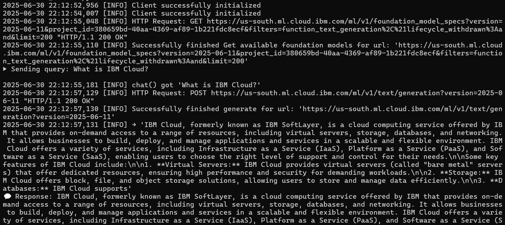

# 🤖 Watsonx Agent MCP Server

> A Python-based MCP “agent” that wraps IBM Watsonx.ai for easy integration into your MCP Gateway.

[]()
[]()

---

## 🚀 Features

- **MCP Protocol** support via stdio and HTTP transports  
- Exposes a single `chat` tool powered by Watsonx.ai text generation  
- Auto-discovers tools in MCP Gateway on registration  
- **Zero-downtime** reloads in development with `uvicorn --reload`  
- Built-in **health** and **version** endpoints (if using HTTP transport)  
- Fully containerized: Docker image + `Makefile` targets  
- **Unit tests** with pytest and CI-ready workflows  

---

## 📦 Project Structure

```text
.
├── Makefile
├── Dockerfile
├── requirements.txt
├── server.py                # FastMCP-based stdio server implementation
├── .env.example             # Copy to .env and fill in credentials
├── tests/                   # test simmple query
│   └── test_server.py
└── README.md
````

---

## ⚙️ Prerequisites

* **Python 3.11+**
* An **IBM Watsonx.ai** instance with:

  * **API Key**
  * **Service URL**
  * **Project ID**
* (Optional) Docker & GNU Make for containerized workflows

---

## 🛠️ Setup & Local Development

1. **Clone & enter project**

   ```bash
   git clone https://github.com/ruslanmv/watsonx-agent.git
   cd watsonx-agent
   ```

2. **Create & activate a virtual environment**

   ```bash
   make setup
   source .venv/bin/activate
   ```

3. **Copy & configure environment variables**

   ```bash
   cp .env.example .env
   # Edit .env:
   # WATSONX_APIKEY=...
   # WATSONX_URL=https://api.us-south.watsonx.ai
   # PROJECT_ID=...
   # MODEL_ID=ibm/granite-13b-instruct-v2
   ```

4. **Run the agent (stdio MCP server)**

   ```bash
   make run
   ```

   The server will listen on **stdin/stdout** speaking MCP.


3. Example of query

   ```bash
   python test/test_server.py
   ```



---


## ⚙️ Makefile Targets

```text
make setup         # Create/update Python venv & install deps
make run           # Start stdio-based MCP server
make lint          # Run flake8 linting
make fmt           # Format code with Black
make test          # Run pytest suite
make docker-build  # Build Docker image
make docker-run    # Run containerized agent
make clean         # Remove .venv
```

---

## 🐳 Docker

1. **Build image**

   ```bash
   make docker-build
   ```

2. **Run container**

   ```bash
   make docker-run
   ```

   This runs `server.py` as `appuser` over stdio. Map ports or mount volumes as needed.


---

## 🔗 Registering in MCP Gateway

1. **Start your MCP Gateway**

2. **Generate an admin JWT**

   ```bash
   export ADMIN_TOKEN=$(
     python -m mcpgateway.utils.create_jwt_token \
       --username "$BASIC_AUTH_USERNAME" \
       --secret   "$JWT_SECRET_KEY" \
       --exp 60
   )
   ```

3. **Via Admin UI**

   * Go to `http://localhost:4444/admin → Catalog → Servers → Add Server`
   * Transport: **STDIO**
   * Command: `/full/path/to/.venv/bin/python`
   * Args: `["/full/path/to/server.py"]`
   * Enable **Auto-discover tools**

4. **Or via HTTP API**

   ```bash
   curl -X POST http://localhost:4444/servers \
     -H "Authorization: Bearer $ADMIN_TOKEN" \
     -H "Content-Type: application/json" \
     -d '{
       "name": "watsonx-agent",
       "transport": "stdio",
       "command": "/path/to/.venv/bin/python",
       "args": ["/path/to/server.py"],
       "autoDiscover": true
     }'
   ```

---

## ✅ Testing & CI

* **Run tests**

  ```bash
  make test
  ```
* **Code coverage** (optional)

  ```bash
  pytest --cov=.
  ```
* **Pre-commit hooks**

  ```bash
  pre-commit install
  ```

---

## 📜 License

This project is licensed under the **Apache 2.0 License**. See [LICENSE](LICENSE) for details.
