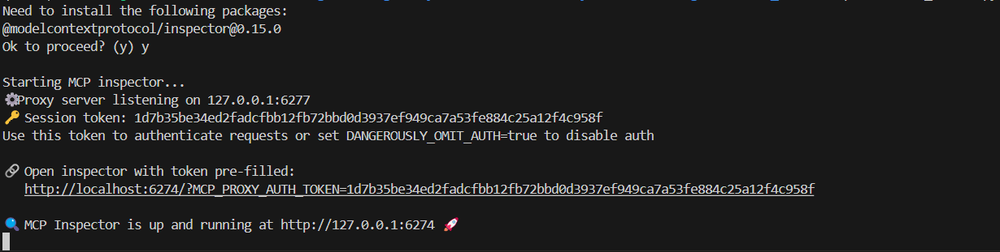
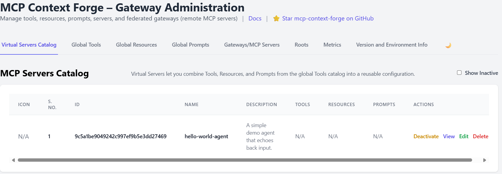

# How to Add Agents in MCP Gateway: A Step-by-Step Tutorial


Welcome to this comprehensive guide on registering “agents” (back-end model/tool servers) in an MCP Gateway. We’ll start with a concise “Hello World” demo, then explore both the **Admin UI** and **HTTP API** methods, and finally walk through a complete example where we integrate a **Watsonx.ai Agent** into your gateway.

---

## 🚀 Table of Contents

1. [Prerequisites](#prerequisites)  
2. [Generating an Admin JWT](#generating-an-admin-jwt)  
3. [Hello World Agent (Demo)](#hello-world-agent-demo)  
   - A) [Via Admin UI](#via-admin-ui)  
   - B) [Via HTTP API](#via-http-api)  
4. [Building a Watsonx.ai Agent](#building-a-watsonxai-agent)  
   - Phase 1: Bootstrapping the Agent  
   - Phase 2: Registering in the Gateway  
5. [Verifying & Using Your Agent](#verifying--using-your-agent)  
6. [Appendix: Full Code Listings](#appendix-full-code-listings)  

---


## Prerequisites

### Step 1: Set up the MCP Gateway

1.  Clone the official MCP Gateway repository into the `mcpgateway` folder.
    ```bash
    git clone https://github.com/IBM/mcp-context-forge.git mcpgateway
    ```
    and enter to the directory
    ```bash
    cd mcpgateway
    ```

2.   Create a virtual environment in ./.venv
    
    ```bash
    python3 -m venv .venv
    ```
3.  Activate it and upgrade pip
    ```bash
        source .venv/bin/activate
        pip install --upgrade pip
    ```
4.  Install the dependencies.
    ```bash
    pip install -e .
    ```
5. Configure credentials  `.env` in your gateway directory containing at least:
    ```bash
    export BASIC_AUTH_USERNAME=admin
    export BASIC_AUTH_PASSWORD=changeme
    export JWT_SECRET_KEY=my-test-key
```


### 2) Start your MCP Gateway

We assume you have already cloned the repo into `mcpgateway/` and have:

    ```bash
    cd mcpgateway
    source .venv/bin/activate
    ./run.sh        # or: mcpgateway --host 0.0.0.0 --port 4444
    ```


   Start the **MCP Gateway** up and running on `HOST:PORT`  (default `0.0.0.0:4444`). 

    # Start MCP Gateway on all interfaces
    ```bash
    mcpgateway --host 0.0.0.0 --port 4444 &
    ```
    By default the CLI binds to 127.0.0.1:4444, user admin, pass admin. Let’s override that:


## Generating an Admin JWT

Many admin operations require a short-lived JWT. Generate one as follows:

```bash
export ADMIN_TOKEN=$(
  python -m mcpgateway.utils.create_jwt_token \
    --username "$BASIC_AUTH_USERNAME" \
    --secret   "$JWT_SECRET_KEY" \
    --exp 60
)
```
Generate your admin JWT:

```bash
export ADMIN_TOKEN=$(
  python -m mcpgateway.utils.create_jwt_token \
    --username "$BASIC_AUTH_USERNAME" \
    --secret   "$JWT_SECRET_KEY" \
    --exp 60
)
```


### 1) Write your Hello World agent

Create this file at

```
agents/hello_world/hello_server.py
```

```python
# agents/hello_world/hello_server.py

import logging
from mcp.server.fastmcp import FastMCP

logging.basicConfig(level=logging.INFO, format="%(asctime)s [%(levelname)s] %(message)s")

# 1) Define a FastMCP server
mcp = FastMCP("Hello World Agent")

# 2) Expose an `echo` tool that simply returns whatever it gets
@mcp.tool()
def echo(text: str) -> str:
    logging.info("echo() called with %r", text)
    return text

# 3) Run on STDIO
if __name__ == "__main__":
    logging.info("Starting Hello World MCP server on STDIO…")
    mcp.run()
```

You can test it locally first:

```bash
cd agents/hello_world
```

2.   Create a virtual environment in ./.venv
    
    ```bash
    python3 -m venv .venv
    ```
3.  Activate it and upgrade pip
    ```bash
        source .venv/bin/activate
        pip install --upgrade pip
    ```

    ```bash
    pip install mcp[cli]       
    ```


```bash
mcp dev hello_server.py
# Inspector UI: http://localhost:6274
# Try calling `echo` with “Hello MCP!”
```


### 3) Register via the Admin UI

1. Open **[http://localhost:4444/admin](http://localhost:4444/admin)** and log in with your Basic Auth credentials.

2. Click **Catalog → Servers → Add Server**.

3. You’ll see only these fields:

   * **Name**
   * **Description**
   * **Icon URL** (optional)
   * **Associated Tools**
   * **Associated Resources** (comma-separated IDs)
   * **Associated Prompts** (comma-separated IDs)

4. Fill them like this:

   * **Name**:

     ```
     hello-world-agent
     ```
   * **Description**:

     ```
     A minimal STDIO agent that echoes back input via the `echo` tool
     ```
   * **Icon URL**:
     (leave blank, or point to a 32×32 PNG if you have one)
   * **Associated Tools**:
     Here you must supply the *tool names* your agent exposes—in our case:

     ```
     echo
     ```
   * **Associated Resources**:
     (leave empty)
   * **Associated Prompts**:
     (leave empty)

5. Click **Add Server**.

   The Gateway will now:

   1. **Spawn** your agent as a subprocess on STDIO by looking up `agents/hello_world/hello_server.py` in its configured “agents” directory.
   2. **Call** its MCP discovery (`mcp.inspect()`) to learn that it exposes the `echo` tool.
   3. **Activate** it—you’ll see `hello-world-agent` appear in your Servers list with a UUID.


---

### 4) Register via HTTP API (alternate)

If you’d rather script it, you can accomplish exactly the same thing with one `curl`:

```bash
curl -X POST http://localhost:4444/servers \
  -H "Authorization: Bearer $ADMIN_TOKEN" \
  -H "Content-Type: application/json" \
  -d '{
        "name": "hello-world-agent",
        "description": "A minimal STDIO agent that echoes back input via the `echo` tool",
        "associatedTools": ["echo"],
        "associatedResources": [],
        "associatedPrompts": []
      }'
```

Then verify:

```bash
curl -s \
  -H "Authorization: Bearer $ADMIN_TOKEN" \
  http://localhost:4444/servers | jq .
```

You should see your `hello-world-agent` entry, `"isActive": true`, and under `tools` an array with `"echo"`.

---

### 5) Try it out

Now any MCP-aware client can do:

```bash
mcp call --server http://localhost:4444 servers/<your-agent-uuid> echo "Hello, MCP!"
# → "Hello, MCP!"
```

Or via raw HTTP:

```bash
curl -X POST http://localhost:4444/ \
  -H "Content-Type: application/json" \
  -d '{
        "jsonrpc":"2.0",
        "method":"tools/call",
        "params":{
          "name":"echo",
          "arguments":{"text":"Hello, MCP!"}
        },
        "id":1
      }'
```

---

### 6) Next up: Watsonx.ai Agent 

With the Hello World demo behind you, you’re ready to plug in our full **Watsonx.ai** agent exactly the same way—just substitute:

* **Tool name**: `chat`
* **Server code**: your `agents/watsonx-agent/server.py` (or `main.py` if using HTTP mode)
* **Associated Tools**: `chat`

Everything else (JWT, UI, CLI) stays identical. Enjoy building your multi-agent workflows!


## Building a Watsonx.ai Agent

Now let’s build and register a real-world agent that wraps IBM Watsonx.ai.

### Phase 1: Bootstrapping the Agent

1. **Provision Watsonx.ai**

   * In IBM Cloud, create or reuse a Watsonx.ai inference service.
   * Generate an API key and note your service URL (e.g. `https://api.us-south.watsonx.ai`).
   * Retrieve your **Project ID**.

2. **Initialize Project**

   ```bash
   mkdir watsonx-agent && cd watsonx-agent
   python3.11 -m venv .venv
   source .venv/bin/activate
   ```

3. **Define Dependencies** in `requirements.txt`:

   ```text
   python-dotenv>=0.21.0
   ibm-watsonx-ai>=1.3.8
   mcp[cli]>=1.6.0
   ```

   Install them:

   ```bash
   pip install --upgrade pip
   pip install -r requirements.txt
   ```

4. **Secure Credentials**
   Create `.env` (add to `.gitignore`):

   ```dotenv
   WATSONX_API_KEY=YOUR_API_KEY
   WATSONX_URL=https://api.us-south.watsonx.ai
   PROJECT_ID=YOUR_PROJECT_ID
   MODEL_ID=ibm/granite-3-3-8b-instruct
   ```

5. **Write `server.py`** (stdio transport):

   ```python
   # server.py
   import os, logging
   from dotenv import load_dotenv
   from mcp.server.fastmcp import FastMCP
   from ibm_watsonx_ai import APIClient, Credentials
   from ibm_watsonx_ai.foundation_models import ModelInference
   from ibm_watsonx_ai.metanames import GenTextParamsMetaNames as GenParams

   # Load settings
   load_dotenv()
   API_KEY    = os.getenv("WATSONX_API_KEY")
   URL        = os.getenv("WATSONX_URL")
   PROJECT_ID = os.getenv("PROJECT_ID")
   MODEL_ID   = os.getenv("MODEL_ID", "ibm/granite-3-3-8b-instruct")

   for name, val in [("WATSONX_API_KEY", API_KEY), ("WATSONX_URL", URL), ("PROJECT_ID", PROJECT_ID)]:
       if not val:
           raise RuntimeError(f"{name} is not set")

   logging.basicConfig(level=logging.INFO, format="%(asctime)s [%(levelname)s] %(message)s")

   creds  = Credentials(url=URL, api_key=API_KEY)
   client = APIClient(credentials=creds, project_id=PROJECT_ID)
   model  = ModelInference(model_id=MODEL_ID, credentials=creds, project_id=PROJECT_ID)

   mcp = FastMCP("Watsonx Chat Agent")

   @mcp.tool()
   def chat(query: str) -> str:
       logging.info("chat() got %r", query)
       params = {
         GenParams.DECODING_METHOD: "greedy",
         GenParams.MAX_NEW_TOKENS:   200,
       }
       resp = model.generate_text(prompt=query, params=params, raw_response=True)
       text = resp["results"][0]["generated_text"].strip()
       logging.info("→ %r", text)
       return text

   if __name__ == "__main__":
       logging.info("Starting Watsonx MCP server on STDIO…")
       mcp.run()
   ```

6. **Test Locally** with the MCP Inspector:

   ```bash
   mcp dev server.py
   # Inspector UI: http://localhost:6274
   ```

---

### Phase 2: Registering in the Gateway

1. **Start your gateway**, if not already running.

2. **Generate an Admin JWT** (see above).

3. **Via Admin UI**

   * Go to **Catalog → Servers → Add Server**.
   * **Name**: `watsonx-agent`
   * **Transport**: `STDIO`
   * **Command**: `/full/path/to/.venv/bin/python`
   * **Args**: `["/full/path/to/watsonx-agent/server.py"]`
   * **Auto-discover tools**: ☑️

4. **Via HTTP API** (alternative):

   ```bash
   curl -X POST http://localhost:4444/servers \
     -H "Authorization: Bearer $ADMIN_TOKEN" \
     -H "Content-Type: application/json" \
     -d '{
           "name": "watsonx-agent",
           "transport": "stdio",
           "command": "/path/to/.venv/bin/python",
           "args": ["/path/to/watsonx-agent/server.py"],
           "autoDiscover": true
         }'
   ```

5. **Verify**:

   ```bash
   curl -s \
     -H "Authorization: Bearer $ADMIN_TOKEN" \
     http://localhost:4444/servers | jq .
   ```

You should see your `watsonx-agent` listed as active with the `chat` tool.

---

## Verifying & Using Your Agent

Once registered, any MCP-aware client can invoke your Watsonx agent:

```bash
# Example: using mcp CLI
mcp call --server http://localhost:4444 servers/<agent-id> chat "Tell me a joke."
```

Or via HTTP:

```bash
curl -X POST http://localhost:4444/ \
  -H "Content-Type: application/json" \
  -d '{
        "jsonrpc":"2.0",
        "method":"tools/call",
        "params":{
          "name":"chat",
          "arguments":{"query":"What is IBM Cloud?"}
        },
        "id":1
      }'
```

---

## Appendix: Full Code Listings

* **Makefile**
* **Dockerfile**
* **server.py**
* **main.py**
* **test/test\_server.py**


🎉 **Congratulations!** You’ve successfully added your Watsonx.ai Agent to MCP Gateway. Now go build awesome multi-agent applications!
