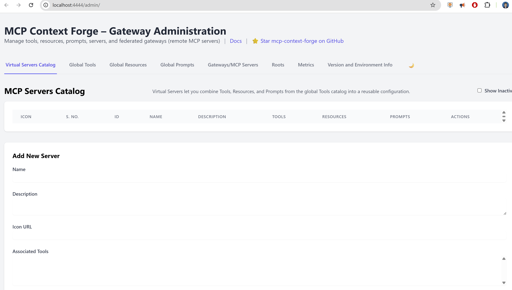

#  Building a Multi-Agent System with MCP Gateway and watsonx.ai

## What is the MCP Gateway and Why Do You Need It?

The MCP Gateway, also known as ContextForge MCP Gateway, is a powerful open-source gateway, proxy, and registry designed for the Model Context Protocol (MCP) and standard REST services. Its primary goal is to act as a single, unified endpoint for AI clients, simplifying how they discover, authenticate with, and monitor various tools and services.

When you ask a Large Language Model (LLM) to perform a task that requires real-world data or actions—like "what's the weather today?" or "summarize this PDF"—the LLM itself can't directly access the internet or your files. It needs **Tools**. These tools are small, specialized services that can perform specific actions. An **AI Agent** then acts as a planner, deciding which tool to use to fulfill your request.

This is where the challenge begins.

### The Problem MCP Gateway Solves

As you develop more tools, you face a few common problems:

  * **Fragmented Ecosystem**: Many AI tools are tightly coupled to specific platforms or frameworks (e.g., LangChain, Autogen), making it difficult to reuse them across different systems.
  * **Lack of Standardization**: Each tool might have its own unique schema, naming conventions, or authentication method, leading to complex and inconsistent integration logic.
  * **Integration Challenges**: Tools are often scattered across different servers, and making them all work together securely and efficiently requires significant effort. Existing REST APIs, for example, must be rewritten to become MCP-compliant.

### How MCP Gateway Works

The MCP Gateway elegantly solves these issues by acting as a **"smart proxy"** or a central dispatcher that sits between your AI applications and your tool servers. It provides a unified and secure access point, simplifying the entire integration process.

You can deploy the gateway in the cloud or on-premises, and it can be used by a wide range of AI clients, including:

  * **AI Applications** like IBM Consulting Advantage or Microsoft Copilot.
  * **Agentic Frameworks** such as watsonx Orchestrate, LangChain, and Autogen.
  * **IDEs** like Visual Studio Code, allowing developers to call tools directly from their editor.

In this tutorial, we will build a complete system with a web frontend that talks to a `watsonx.ai` chatbot, all orchestrated through the MCP Gateway.

## Step-by-Step Tutorial: From Zero to a Running Chatbot

This end-to-end walkthrough will guide you from a clean directory to a running web application powered by multiple agents.

### Prerequisites

Before we start, make sure you have the following installed on your system.

  * **Go (version 1.21+):**
    ```bash
    go version
    ```
  * **Python (version 3.11+):**
    ```bash
    python --version
    ```
  * **Docker:**
    ```bash
    docker --version
    ```
  * **Git:**
    ```bash
    git --version
    ```
  * **watsonx.ai Account:** You need an IBM Cloud account with access to watsonx.ai.

### Project Structure

First, let's set up our project directory.
1.  Inside, create folders for the gateway, agents, and frontend.
    ```bash
    mkdir mcpgateway
    mkdir agents
    mkdir frontend
    ```
3.  Your final structure will look like this:
    ```
    ├── mcpgateway/
    ├── agents/
    │   ├── go_time_server/
    │   └── python_watsonx_agent/
    └── frontend/
    ```

### Step 1: Set up the MCP Gateway

1.  Clone the official MCP Gateway repository into the `mcpgateway` folder.
    ```bash
    git clone https://github.com/IBM/mcp-context-forge.git mcpgateway
    ```
    and enter to the directory
    ```bash
    cd mcpgateway
    ```

2.   Create a virtual environment in ./.venv
    
    ```bash
    python3 -m venv .venv
    ```
3.  Activate it and upgrade pip
    ```bash
        source .venv/bin/activate
        pip install --upgrade pip
    ```
4.  Install the dependencies.
    ```bash
    pip install -e .
    ```
4.  Configure credentials and start the gateway
By default the CLI binds to 127.0.0.1:4444, user admin, pass admin. Let’s override that:


    ```bash
    export BASIC_AUTH_USERNAME=admin
    export BASIC_AUTH_PASSWORD=changeme
    export JWT_SECRET_KEY=my-test-key

    # Start MCP Gateway on all interfaces
    mcpgateway --host 0.0.0.0 --port 4444 &

    ```

    
### Step 2: Create the `fast-time-server` Agent (Go)

This agent provides the current time. It's a great simple example of a non-Python agent.

1.  Create the directory.

    ```bash
    mkdir -p agents/go_time_server
    cd agents/go_time_server
    ```

2.  Create a file named `main.go` and paste the following code into it. This code is a simplified version from the official repository for tutorial purposes.

```go
// main.go
package main

import (
	"encoding/json"
	"fmt"
	"io/ioutil"
	"log"
	"net/http"
	"os"
	"time"
)

type ToolRequest struct {
	Tool string          `json:"tool"`
	Args json.RawMessage `json:"args"`
}

type ToolResponse struct {
	Result string `json:"result"`
}

func toolHandler(w http.ResponseWriter, r *http.Request) {
	body, err := ioutil.ReadAll(r.Body)
	if err != nil {
		http.Error(w, "Cannot read body", http.StatusBadRequest)
		return
	}

	var req ToolRequest
	if err := json.Unmarshal(body, &req); err != nil {
		http.Error(w, "Cannot unmarshal JSON", http.StatusBadRequest)
		return
	}

	var result string
	switch req.Tool {
	case "get_system_time":
		result = time.Now().UTC().Format(time.RFC3339)
	default:
		http.Error(w, fmt.Sprintf("Tool not found: %s", req.Tool), http.StatusNotFound)
		return
	}

	resp := ToolResponse{Result: result}
	w.Header().Set("Content-Type", "application/json")
	json.NewEncoder(w).Encode(resp)
}

func main() {
	listenAddr := ":8081"
	if port := os.Getenv("PORT"); port != "" {
		listenAddr = ":" + port
	}

	http.HandleFunc("/http", toolHandler)
	log.Printf("Starting Go time server on %s", listenAddr)
	if err := http.ListenAndServe(listenAddr, nil); err != nil {
		log.Fatalf("Failed to start server: %v", err)
	}
}

```

3.  Navigate back to the root directory.

    ```bash
    cd ../..
    ```


### Step 3: Create the `watsonx.ai` Chatbot Agent (Python)

This is our star agent. It will connect to `watsonx.ai` to provide chat capabilities.

1.  **Get watsonx.ai Credentials:**

      * Log in to your [IBM Cloud Account](https://cloud.ibm.com/).
      * Navigate to your `watsonx.ai` instance and create a project.
      * Generate an **API Key**.
      * Find your **Project ID** in the project settings.
      * Note your region's **URL** (e.g., `https://us-south.ml.cloud.ibm.com`).

2.  **Create Environment Files:**
    Create a file named `.env` in your project directory to securely store your credentials.

    ```bash
    # .env
    WATSONX_APIKEY="your_api_key_here"
    WATSONX_URL="your_watsonx_url_here"
    PROJECT_ID="your_project_id_here"
    ```

3.  **Create the agent's directory.**

    ```bash
    mkdir -p agents/python_watsonx_agent
    cd agents/python_watsonx_agent
    ```

4.  **Create a `requirements.txt` file for its dependencies.**

    ```text
    # requirements.txt
    fastapi
    uvicorn
    python-dotenv
    ibm-watsonx-ai
    ```

5.  **Create a simple python environment and install dependencies.**

    ```bash
    python3 -m venv .venv
    source .venv/bin/activate
    pip install -r requirements.txt
    ```

6.  **Create a file named `main.py` and paste the following full code into it.**

```python
"""
main.py – Minimal, robust Watsonx Chat Agent
"""

from __future__ import annotations

import logging
import os
from functools import lru_cache
from typing import Final, Optional

from dotenv import load_dotenv
from fastapi import Depends, FastAPI, HTTPException, status
from pydantic import BaseModel

# --------------------------------------------------------------------------- #
# IBM Watsonx SDK imports
# --------------------------------------------------------------------------- #
try:
    from ibm_watsonx_ai.credentials import Credentials
    from ibm_watsonx_ai.foundation_models import ModelInference
    from ibm_watsonx_ai.metanames import GenTextParamsMetaNames as GenParams
except ImportError as exc:  # pragma: no cover
    raise SystemExit(
        "The package `ibm-watsonx-ai` is required. "
        "Install it with `pip install ibm-watsonx-ai`."
    ) from exc

# --------------------------------------------------------------------------- #
# Logging
# --------------------------------------------------------------------------- #
logging.basicConfig(
    format="%(asctime)s | %(levelname)s | %(name)s | %(message)s",
    datefmt="%Y-%m-%d %H:%M:%S",
    level=logging.INFO,
)
logger: Final = logging.getLogger("watsonx-agent")

# --------------------------------------------------------------------------- #
# Configuration
# --------------------------------------------------------------------------- #
load_dotenv()  # .env support

WATSONX_APIKEY: Final[str | None] = os.getenv("WATSONX_APIKEY")
WATSONX_URL:    Final[str | None] = os.getenv("WATSONX_URL")
PROJECT_ID:     Final[str | None] = os.getenv("PROJECT_ID")

if not all([WATSONX_APIKEY, WATSONX_URL, PROJECT_ID]):
    missing = [k for k, v in {
        "WATSONX_APIKEY": WATSONX_APIKEY,
        "WATSONX_URL":    WATSONX_URL,
        "PROJECT_ID":     PROJECT_ID,
    }.items() if not v]
    raise SystemExit(
        f"Missing required environment variables: {', '.join(missing)}. "
        "Create a .env file or export them before running."
    )

# --------------------------------------------------------------------------- #
# Pydantic models
# --------------------------------------------------------------------------- #
class ToolArgs(BaseModel):
    prompt: str


class ToolRequest(BaseModel):
    tool: str
    args: ToolArgs


class ToolResponse(BaseModel):
    result: str


# --------------------------------------------------------------------------- #
# Model initialisation (lazy singleton)
# --------------------------------------------------------------------------- #
@lru_cache
def get_model() -> Optional[ModelInference]:
    """
    Cache a single ModelInference client. Return None if initialisation fails
    so later requests can respond quickly with 503.
    """
    logger.info("Initialising Watsonx.ai model …")

    # --- Watsonx.ai Model Initialisation ---
    credentials = Credentials(url=WATSONX_URL, api_key=WATSONX_APIKEY)
    decoding="sample"
    if decoding == "sample":

        parameters = {
            GenParams.DECODING_METHOD: "sample",
            GenParams.MAX_NEW_TOKENS: 512,
            GenParams.MIN_NEW_TOKENS: 50,
            GenParams.TEMPERATURE: 0.7,
            GenParams.TOP_P: 0.9,
            GenParams.REPETITION_PENALTY: 1.2,
            GenParams.STOP_SEQUENCES: ["\n\n", "===", "---"],
        }
    else:
            parameters = {                      
        GenParams.DECODING_METHOD:    "greedy",
        GenParams.MAX_NEW_TOKENS:     512,
        GenParams.MIN_NEW_TOKENS:     1,
        GenParams.REPETITION_PENALTY: 1.1,
        GenParams.STOP_SEQUENCES:     ["\n\n", "===", "---"],
    }


    try:
        model = ModelInference(
            model_id="ibm/granite-13b-instruct-v2",
            params=parameters,
            credentials=credentials,
            project_id=PROJECT_ID,
        )
        logger.info("Watsonx.ai model ready.")
        return model
    except Exception as exc:
        logger.exception("Watsonx.ai initialisation failed", exc_info=True)
        return None  # type: ignore[return-value]


# --------------------------------------------------------------------------- #
# FastAPI application
# --------------------------------------------------------------------------- #
app = FastAPI(
    title="Watsonx Chat Agent",
    description="MCP-compatible microservice backed by IBM Watsonx.ai",
    version="1.0.0",
)


@app.get("/", summary="Health-check")
async def health() -> dict[str, str]:
    return {"status": "ok", "agent": "watsonx-agent"}


@app.post("/http", response_model=ToolResponse, summary="Invoke tool")
async def call_tool(
    payload: ToolRequest,
    model: Optional[ModelInference] = Depends(get_model),
) -> ToolResponse:
    """Only the 'chat' tool is supported."""
    if payload.tool.lower() != "chat":
        raise HTTPException(
            status_code=status.HTTP_404_NOT_FOUND,
            detail=f"Tool '{payload.tool}' not found.",
        )

    if model is None:
        raise HTTPException(
            status_code=status.HTTP_503_SERVICE_UNAVAILABLE,
            detail="Watsonx model unavailable",
        )

    prompt_preview = payload.args.prompt.replace("\n", " ")[:80]
    logger.info("Prompt: %s%s", prompt_preview, "…" if len(prompt_preview) == 80 else "")

    try:
        result = model.generate_text(prompt=payload.args.prompt)
        return ToolResponse(result=result)
    except Exception as exc:  # pragma: no cover
        logger.exception("Watsonx.ai error")
        raise HTTPException(
            status_code=status.HTTP_502_BAD_GATEWAY,
            detail="Error communicating with Watsonx.ai",
        ) from exc


# --------------------------------------------------------------------------- #
# Entry-point
# --------------------------------------------------------------------------- #
if __name__ == "__main__":  # pragma: no cover
    import uvicorn

    logger.info("Starting Watsonx Chat Agent at http://0.0.0.0:8082")
    uvicorn.run("main:app", host="0.0.0.0", port=8082, log_level="info")

```

7.  **Run the agent.**
    From inside the `.venv` virtual environment, run the following command:

    ```bash
    uvicorn main:app --host 0.0.0.0 --port 8082
    ```

7.  Navigate back to the root directory.

    ```bash
    cd ../..
    ```

### Step 4: Create the Frontend

This is a simple HTML page with JavaScript to communicate with our gateway.

1.  Navigate to the `frontend` directory.

    ```bash
    cd frontend
    ```

2.  Create a file named `index.html` and paste this code into it.

    ```html
    <!DOCTYPE html>
    <html lang="en">
    <head>
        <meta charset="UTF-8">
        <meta name="viewport" content="width=device-width, initial-scale=1.0">
        <title>MCP Gateway Chat</title>
        <style>
            body { font-family: -apple-system, BlinkMacSystemFont, "Segoe UI", Roboto, Helvetica, Arial, sans-serif; margin: 40px; background-color: #f0f2f5; }
            #chat-container { max-width: 700px; margin: auto; background: white; border-radius: 8px; box-shadow: 0 2px 10px rgba(0,0,0,0.1); padding: 20px; }
            #messages { height: 400px; overflow-y: scroll; border: 1px solid #ddd; padding: 10px; margin-bottom: 10px; border-radius: 6px; }
            .message { margin-bottom: 15px; }
            .user-message { text-align: right; color: #0050be; }
            .bot-message { text-align: left; color: #333; }
            #input-form { display: flex; }
            #input-box { flex-grow: 1; border: 1px solid #ccc; padding: 10px; border-radius: 6px; }
            #send-button { background-color: #0078d4; color: white; border: none; padding: 10px 15px; margin-left: 10px; border-radius: 6px; cursor: pointer; }
            #send-button:disabled { background-color: #aaa; }
        </style>
    </head>
    <body>

        <div id="chat-container">
            <h1>Chat with watsonx.ai via MCP Gateway</h1>
            <div id="messages"></div>
            <form id="input-form">
                <input type="text" id="input-box" placeholder="Ask something..." autocomplete="off">
                <button type="submit" id="send-button">Send</button>
            </form>
        </div>

        <script>
            const form = document.getElementById('input-form');
            const inputBox = document.getElementById('input-box');
            const messagesDiv = document.getElementById('messages');
            const sendButton = document.getElementById('send-button');

            const GATEWAY_URL = 'http://localhost:8000/call';

            form.addEventListener('submit', async (e) => {
                e.preventDefault();
                const userInput = inputBox.value.trim();
                if (!userInput) return;

                addMessage(userInput, 'user-message');
                inputBox.value = '';
                sendButton.disabled = true;

                try {
                    const response = await fetch(GATEWAY_URL, {
                        method: 'POST',
                        headers: { 'Content-Type': 'application/json' },
                        body: JSON.stringify({
                            tool: "watsonx-agent/chat",
                            args: {
                                prompt: userInput
                            }
                        })
                    });

                    if (!response.ok) {
                        throw new Error(`HTTP error! Status: ${response.status}`);
                    }

                    const data = await response.json();
                    addMessage(data.result, 'bot-message');

                } catch (error) {
                    console.error('Error:', error);
                    addMessage('Sorry, something went wrong.', 'bot-message');
                } finally {
                    sendButton.disabled = false;
                    inputBox.focus();
                }
            });

            function addMessage(text, className) {
                const msgDiv = document.createElement('div');
                msgDiv.className = `message ${className}`;
                msgDiv.textContent = text;
                messagesDiv.appendChild(msgDiv);
                messagesDiv.scrollTop = messagesDiv.scrollHeight;
            }
        </script>

    </body>
    </html>
    ```

3.  Go back to the root directory.

    ```bash
    cd ..
    ```

### Step 5: Run Everything\!

Now we orchestrate all the pieces. You will need **three separate terminal windows** open, all starting from the root of your `mcp-watsonx-tutorial` project.

**Terminal 1: Run the MCP Gateway**
This terminal will run the central gateway service.

```bash
# Navigate to the gateway directory from the project root
cd mcpgateway

# Activate the virtual environment
source .venv/bin/activate

# Set required environment variables for the gateway
export BASIC_AUTH_USERNAME=admin
export BASIC_AUTH_PASSWORD=changeme
export JWT_SECRET_KEY=my-super-secret-key

# Start the gateway on port 4444
mcpgateway --host 0.0.0.0 --port 4444
```

Leave this terminal running. You should see log messages from the gateway.

**Terminal 2: Run the Go Time Server Agent**
This terminal will run our simple utility agent.

```bash
# Navigate to the agent's directory from the project root
cd agents/go_time_server

# Initialize the Go module (only needed once)
go mod init time-agent
go mod tidy

# Build and run the agent
go run main.go
```

This agent will now be running and logging: `Starting Go time server on :8081`.

**Terminal 3: Run the Python Watsonx Agent**
This terminal will run our main chatbot agent.

```bash
# Navigate to the agent's directory from the project root
cd agents/python_watsonx_agent

# Activate the virtual environment
source .venv/bin/activate

# Run the FastAPI server using uvicorn
uvicorn main:app --host 0.0.0.0 --port 8082
```

This agent will now be running on port `8082`.

### Step 6: Register the Agents with the Gateway

With all three services running, open a **fourth terminal** to register the agents. The gateway needs to know the address of each agent to route requests correctly.

1.  **Register the Go Time Server:**
    *(Note: This agent runs on port `8081`)*

    ```bash
    curl -X POST http://localhost:4444/servers \
      -H "Content-Type: application/json" \
      -u "admin:changeme" \
      -d '{
        "name": "go-time-agent",
        "description": "Go service for getting the current time",
        "url": "http://localhost:8081/http"
      }'
    ```

2.  **Register the Python Watsonx Agent:**
    *(Note: This agent runs on port `8082`)*

    ```bash
    curl -X POST http://localhost:4444/servers \
      -H "Content-Type: application/json" \
      -u "admin:changeme" \
      -d '{
        "name": "watsonx-agent",
        "description": "Python agent for watsonx.ai chat",
        "url": "http://localhost:8082/http"
      }'
    ```

You should receive a confirmation response from the gateway for each command.

### Step 7: Test the Full Application



You are now ready to see everything work together.

1.  **Update the Frontend URL:**
    Before opening the frontend, you must ensure it points to the correct gateway port. Open the `frontend/index.html` file and find this line:
    `const GATEWAY_URL = 'http://localhost:8000/call';`

    Change it to point to port `4444`:
    `const GATEWAY_URL = 'http://localhost:4444/call';`

2.  **Open the Frontend:**
    Open the `frontend/index.html` file in your web browser. You can usually do this by right-clicking the file and choosing "Open with Browser" or by typing `file:///path/to/your/project/frontend/index.html` in the URL bar.

3.  **Chat with your Agent:**
    Type a message into the chat box, such as "Hello\! Can you write a short poem about AI?" and press Send.

    The request will travel from your browser to the MCP Gateway, which will see the `watsonx-agent/chat` tool request and correctly route it to your Python agent. The agent will call `watsonx.ai`, get the response, and send it back along the same path.

### Conclusion: What You've Built

Congratulations\! You have successfully built and orchestrated a complete multi-agent application.

You have learned how to:

  * Set up and run the **MCP Gateway** as a central service registry and proxy.
  * Create two distinct **agents** in different programming languages (Go and Python).
  * **Register** those agents with the gateway so they can be discovered and used.
  * Build a simple **web frontend** that can interact with a specific agent through the unified gateway endpoint.

This architecture is the foundation for building powerful, scalable, and maintainable AI systems. From here, you can add more specialized agents, explore advanced gateway features like security and caching, and build even more complex applications.